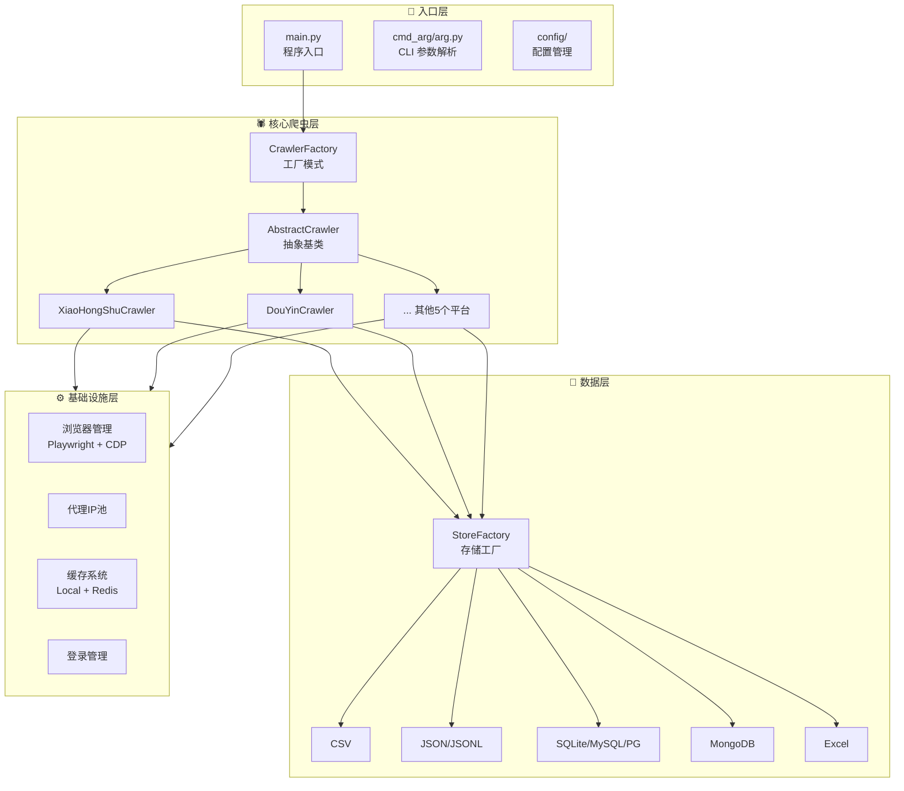
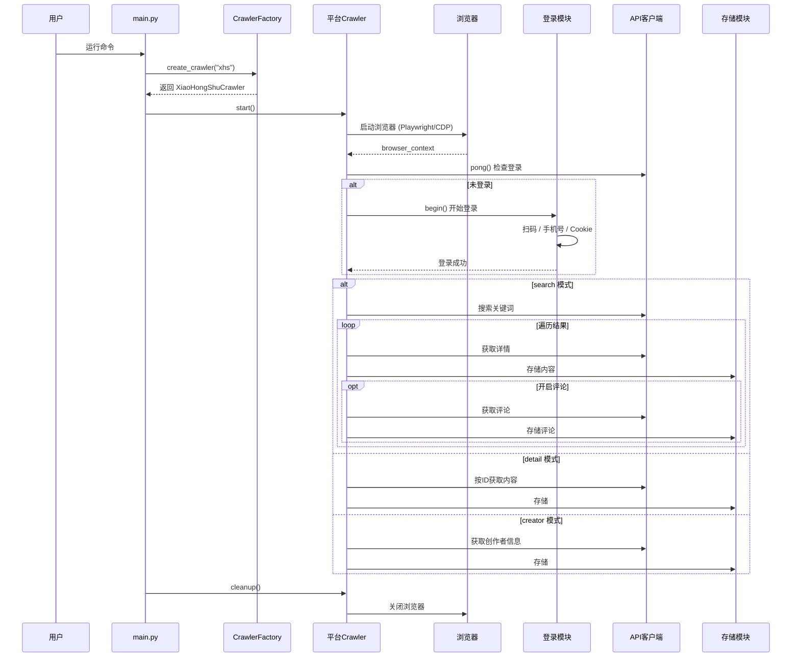

# MediaCrawler 深度分析报告

## 一、项目概览

| 维度 | 详情 |
|------|------|
| **项目名称** | MediaCrawler |
| **作者** | 程序员阿江-Relakkes (relakkes@gmail.com) |
| **仓库地址** | [NanmiCoder/MediaCrawler](https://github.com/NanmiCoder/MediaCrawler) |
| **许可证** | NON-COMMERCIAL LEARNING LICENSE 1.1（仅限学习，禁止商用） |
| **Python 版本** | >= 3.11 |
| **代码规模** | 154 个 Python 文件，约 15000+ 行核心代码 |
| **核心技术** | Playwright 浏览器自动化 + CDP 模式 + 异步编程 |

### 支持平台一览

| 平台 | 代号 | 关键词搜索 | 指定ID爬取 | 二级评论 | 创作者主页 | 登录态缓存 | IP代理 | 词云图 |
|------|------|:---:|:---:|:---:|:---:|:---:|:---:|:---:|
| 小红书 | `xhs` | ✅ | ✅ | ✅ | ✅ | ✅ | ✅ | ✅ |
| 抖音 | `dy` | ✅ | ✅ | ✅ | ✅ | ✅ | ✅ | ✅ |
| 快手 | `ks` | ✅ | ✅ | ✅ | ✅ | ✅ | ✅ | ✅ |
| B 站 | `bili` | ✅ | ✅ | ✅ | ✅ | ✅ | ✅ | ✅ |
| 微博 | `wb` | ✅ | ✅ | ✅ | ✅ | ✅ | ✅ | ✅ |
| 百度贴吧 | `tieba` | ✅ | ✅ | ✅ | ✅ | ✅ | ✅ | ✅ |
| 知乎 | `zhihu` | ✅ | ✅ | ✅ | ✅ | ✅ | ✅ | ✅ |

---

## 二、架构设计深度剖析

### 2.1 四层架构



### 2.2 核心设计模式

| 设计模式 | 应用位置 | 作用 |
|---------|---------|------|
| **工厂模式** | `CrawlerFactory` / `StoreFactory` | 统一创建爬虫实例和存储实例，解耦平台与创建逻辑 |
| **抽象基类** | `AbstractCrawler` / `AbstractLogin` / `AbstractStore` / `AbstractApiClient` | 定义统一接口，保证所有平台实现一致性 |
| **策略模式** | 存储层支持 7 种存储方式自由切换 | 运行时动态选择存储策略 |
| **Mixin 混入** | `ProxyRefreshMixin` | 代理刷新能力复用，避免多重继承复杂性 |
| **模板方法** | 每个平台 `core.py` 中的 `start()` 流程 | 统一爬虫生命周期（启动→登录→爬取→存储→清理） |

### 2.3 爬虫生命周期



---

## 三、核心模块分析

### 3.1 命令行参数体系

项目使用 [Typer](https://typer.tiangolo.com/) 框架构建 CLI，支持以下核心参数：

| 参数 | 类型 | 说明 |
|------|------|------|
| `--platform` | `xhs\|dy\|ks\|bili\|wb\|tieba\|zhihu` | 目标平台 |
| `--lt` | `qrcode\|phone\|cookie` | 登录方式 |
| `--type` | `search\|detail\|creator` | 爬取模式 |
| `--keywords` | 字符串 | 搜索关键词（逗号分隔） |
| `--specified_id` | 字符串 | 指定帖子/视频ID列表 |
| `--creator_id` | 字符串 | 指定创作者ID列表 |
| `--get_comment` | 布尔 | 是否爬评论 |
| `--get_sub_comment` | 布尔 | 是否爬二级评论 |
| `--save_data_option` | 多种 | 数据存储方式 |
| `--headless` | 布尔 | 无头模式 |
| `--init_db` | `sqlite\|mysql\|postgres` | 初始化数据库 |
| `--max_concurrency_num` | 整数 | 最大并发数 |
| `--max_comments_count_singlenotes` | 整数 | 单帖最大评论数 |
| `--save_data_path` | 字符串 | 自定义存储路径 |
| `--enable_ip_proxy` | 布尔 | 是否开启IP代理 |

### 3.2 配置体系

```
config/
├── base_config.py      ← 核心全局配置（平台、登录、存储等）
├── db_config.py        ← 数据库连接配置
├── xhs_config.py       ← 小红书专属配置（排序方式、指定笔记列表）
├── dy_config.py        ← 抖音专属配置
├── ks_config.py        ← 快手专属配置
├── bilibili_config.py  ← B站专属配置
├── weibo_config.py     ← 微博专属配置
├── tieba_config.py     ← 贴吧专属配置
└── zhihu_config.py     ← 知乎专属配置
```

**配置优先级**：命令行参数 > `base_config.py` 中的值，CLI 参数会覆盖配置文件。

### 3.3 浏览器双模式

| 特性 | 标准 Playwright 模式 | CDP 模式（推荐） |
|-----|---------------------|-----------------|
| 浏览器来源 | Playwright 自带 Chromium | 用户已安装的 Chrome/Edge |
| 反检测能力 | 一般，需注入 stealth.js | 强，真实浏览器指纹 |
| 用户数据 | 独立沙盒 | 继承用户扩展/Cookie/设置 |
| 配置 | `ENABLE_CDP_MODE = False` | `ENABLE_CDP_MODE = True` |
| 适用场景 | 无 Chrome/Edge 的服务器 | 本地开发（推荐） |

CDP 模式工作原理：
1. **浏览器检测**：自动扫描系统中的 Chrome/Edge 安装路径
2. **进程启动**：使用 `--remote-debugging-port` 参数启动浏览器
3. **CDP 连接**：通过 WebSocket 连接到浏览器的调试接口
4. **Playwright 集成**：使用 `connectOverCDP` 方法接管浏览器控制
5. **上下文管理**：创建或复用浏览器上下文进行操作

### 3.4 存储体系

支持 **8 种存储方式**，通过工厂模式实现零耦合切换：

| 方式 | 配置值 | 特点 | 适合场景 |
|------|--------|------|---------|
| JSONL | `jsonl` | **默认**，追加写入，性能好 | 大规模增量爬取 |
| JSON | `json` | 结构完整 | API 对接 |
| CSV | `csv` | 简单通用 | 快速查看 |
| Excel | `excel` | 可视化，多工作表 | 数据分析/报告 |
| SQLite | `sqlite` | 轻量无服务器 | 个人/小型项目 |
| MySQL | `db` | 高并发 | 生产环境 |
| PostgreSQL | `postgres` | 高级关系型 | 生产环境 |
| MongoDB | `mongodb` | 灵活 NoSQL | 非结构化数据 |

### 3.5 代理系统

支持多家代理 IP 提供商：

| 提供商 | 配置值 | 说明 |
|--------|--------|------|
| 快代理 | `kuaidaili` | 国内主流代理服务 |
| 万代理 | `wandouhttp` | 可选代理服务 |
| 技术IP | `jishuhttp` | 可选代理服务 |

代理配置通过 `.env` 文件设置 API Key，`ProxyRefreshMixin` 自动处理代理过期刷新。

### 3.6 缓存系统

| 缓存类型 | 实现类 | 适用场景 |
|---------|--------|---------|
| 本地缓存 | `ExpiringLocalCache` | 单机运行，无需额外服务 |
| Redis 缓存 | `RedisCache` | 分布式/持久化场景 |

通过 `CacheFactory` 工厂创建，支持 TTL 过期机制。

### 3.7 技术依赖清单

| 分类 | 依赖库 | 版本 | 用途 |
|------|--------|------|------|
| 浏览器自动化 | playwright | 1.45.0 | 核心浏览器控制 |
| HTTP 客户端 | httpx | 0.28.1 | 异步 HTTP 请求 |
| 数据验证 | pydantic | 2.5.2 | 数据模型校验 |
| 数据处理 | pandas | 2.2.3 | 数据分析 |
| HTML 解析 | parsel | 1.9.1 | 页面内容提取 |
| ORM | sqlalchemy | >= 2.0.43 | 数据库操作 |
| MySQL 驱动 | aiomysql | 0.2.0 | 异步 MySQL |
| SQLite 驱动 | aiosqlite | >= 0.21.0 | 异步 SQLite |
| MongoDB 驱动 | motor | >= 3.3.0 | 异步 MongoDB |
| PostgreSQL 驱动 | asyncpg | >= 0.31.0 | 异步 PostgreSQL |
| 图片处理 | Pillow | 12.1.0 | 二维码/图片处理 |
| 计算机视觉 | opencv-python | — | 滑块验证码处理 |
| 中文分词 | jieba | 0.42.1 | 词云中文分词 |
| 词云生成 | wordcloud | 1.9.3 | 评论词云图 |
| JS 执行 | pyexecjs | 1.5.1 | 签名算法执行 |
| Web 框架 | fastapi | 0.110.2 | WebUI API |
| CLI 框架 | typer | >= 0.12.3 | 命令行参数 |

---

## 四、每个平台的爬虫结构

每个平台目录遵循统一的「六文件」结构：

```
media_platform/{platform}/
├── __init__.py      → 模块导出
├── core.py          → 核心爬虫类（继承 AbstractCrawler）
├── client.py        → API 客户端（继承 AbstractApiClient）
├── login.py         → 登录实现（继承 AbstractLogin）
├── field.py         → 枚举 / 字段定义
├── exception.py     → 自定义异常
└── help.py          → 辅助工具函数
```

### 平台核心差异

| 平台 | 签名方式 | 特殊处理 | 依赖 |
|------|---------|---------|------|
| 小红书 | JS 签名（浏览器 JS 表达式） | 需要 xsec_token | — |
| 抖音 | JS 签名（`libs/douyin.js`） | Node.js 执行签名 | Node.js >= 16 |
| 快手 | JS 签名 | — | — |
| B 站 | Cookie + WBI 签名 | — | — |
| 微博 | Cookie | 支持图片/视频下载 | — |
| 百度贴吧 | 无需签名 | 使用 parsel HTML 解析 | — |
| 知乎 | JS 签名（`libs/zhihu.js`） | Node.js 执行签名 | Node.js >= 16 |

---

## 五、数据库模型设计

每个平台对应三张核心表：

| 数据类型 | 抖音 | 小红书 | 快手 | B站 | 微博 | 知乎 |
|---------|------|-------|------|-----|------|------|
| **内容** | `DouyinAweme` | `XHSNote` | `KuaishouVideo` | `BilibiliVideo` | `WeiboNote` | `ZhihuContent` |
| **评论** | `DouyinAwemeComment` | `XHSNoteComment` | `KuaishouVideoComment` | `BilibiliVideoComment` | `WeiboNoteComment` | `ZhihuContentComment` |
| **创作者** | `DyCreator` | `XHSCreator` | `KsCreator` | `BilibiliUpInfo` | `WeiboCreator` | `ZhihuCreator` |

所有模型使用 SQLAlchemy ORM，支持自动去重（基于唯一约束 `UK`），每条记录包含 `add_ts` 和 `last_modify_ts` 时间戳。

典型数据模型字段（以抖音为例）：

```
DouyinAweme:
├── id (PK)              # 自增主键
├── aweme_id (UK)        # 视频唯一标识
├── aweme_type           # 视频类型
├── title                # 标题
├── desc                 # 描述
├── create_time          # 发布时间
├── liked_count          # 点赞数
├── collected_count      # 收藏数
├── comment_count        # 评论数
├── share_count          # 分享数
├── user_id (FK)         # 创作者ID
├── add_ts               # 入库时间
└── last_modify_ts       # 最后更新时间
```

---

## 六、WebUI 分析

项目提供基于 FastAPI 的 Web 管理界面：

| 模块 | 文件 | 功能 |
|------|------|------|
| API 路由 | `api/routers/crawler.py` | 爬虫任务管理（启动/停止） |
| API 路由 | `api/routers/data.py` | 数据查询与导出 |
| API 路由 | `api/routers/websocket.py` | 实时日志推送 |
| 服务层 | `api/services/crawler_manager.py` | 爬虫进程管理 |
| 数据模型 | `api/schemas/crawler.py` | 请求/响应数据定义 |
| 入口 | `api/main.py` | FastAPI 应用启动 |

启动方式：`uv run uvicorn api.main:app --port 8080 --reload`

WebUI 功能特性：
- 可视化配置爬虫参数（平台、登录方式、爬取类型等）
- 实时查看爬虫运行状态和日志
- 数据预览和导出

---

## 七、项目优势与不足

### ✅ 优势

1. **架构清晰**：四层架构 + 工厂模式 + 抽象基类，扩展新平台只需实现 6 个文件
2. **反检测能力强**：CDP 模式使用真实浏览器，大幅降低被封概率
3. **存储灵活**：8 种存储方式零耦合切换，从文件到数据库全覆盖
4. **CLI + WebUI 双入口**：命令行适合自动化，WebUI 适合小白可视化操作
5. **异步高并发**：基于 asyncio 异步架构，支持并发爬取控制
6. **功能完整**：搜索/详情/创作者三种模式 + 评论爬取 + 词云生成
7. **无需逆向**：免 JS 逆向，利用浏览器上下文获取签名，降低技术门槛
8. **文档齐全**：有完善的中英西三语 README、架构文档、使用指南

### ⚠️ 不足

1. **非商用许可**：仅限学习研究，禁止商业使用
2. **依赖 Node.js**：抖音和知乎平台需额外安装 Node.js
3. **Windows 为主**：部分功能在 Linux 上的 CDP 模式支持有限
4. **无断点续爬**：开源版不支持断点续爬（Pro 版支持）
5. **单账号限制**：开源版仅支持单账号（Pro 版支持多账号轮换）
6. **风控易触发**：大量爬取容易触发平台风控机制

---

## 八、学习价值分析

### 适合学习的技术点

| 技术点 | 对应模块 | 学习价值 |
|--------|---------|---------|
| Python 异步编程 | 全局 asyncio | ⭐⭐⭐⭐⭐ |
| 设计模式（工厂/策略/模板方法） | `base/`、`store/` | ⭐⭐⭐⭐⭐ |
| Playwright 浏览器自动化 | `tools/` | ⭐⭐⭐⭐⭐ |
| CDP 原理与反检测 | `tools/cdp_browser.py` | ⭐⭐⭐⭐ |
| ORM 数据库操作 | `database/` | ⭐⭐⭐⭐ |
| FastAPI Web 开发 | `api/` | ⭐⭐⭐ |
| 代理 IP 池管理 | `proxy/` | ⭐⭐⭐ |
| CLI 工具开发 | `cmd_arg/` | ⭐⭐⭐ |

---

## 九、安全与合规提醒

> ⚠️ **重要警告**

1. 本项目**严禁商业使用**，仅供学习研究
2. 使用时需遵守目标平台的 robots.txt 和使用条款
3. 请**合理控制请求频率**，避免对平台造成负担
4. 不得用于大规模爬取或任何非法用途
5. 爬取的数据不得侵犯他人隐私或知识产权
6. 违规使用可能面临法律风险，用户需自行承担一切法律责任
