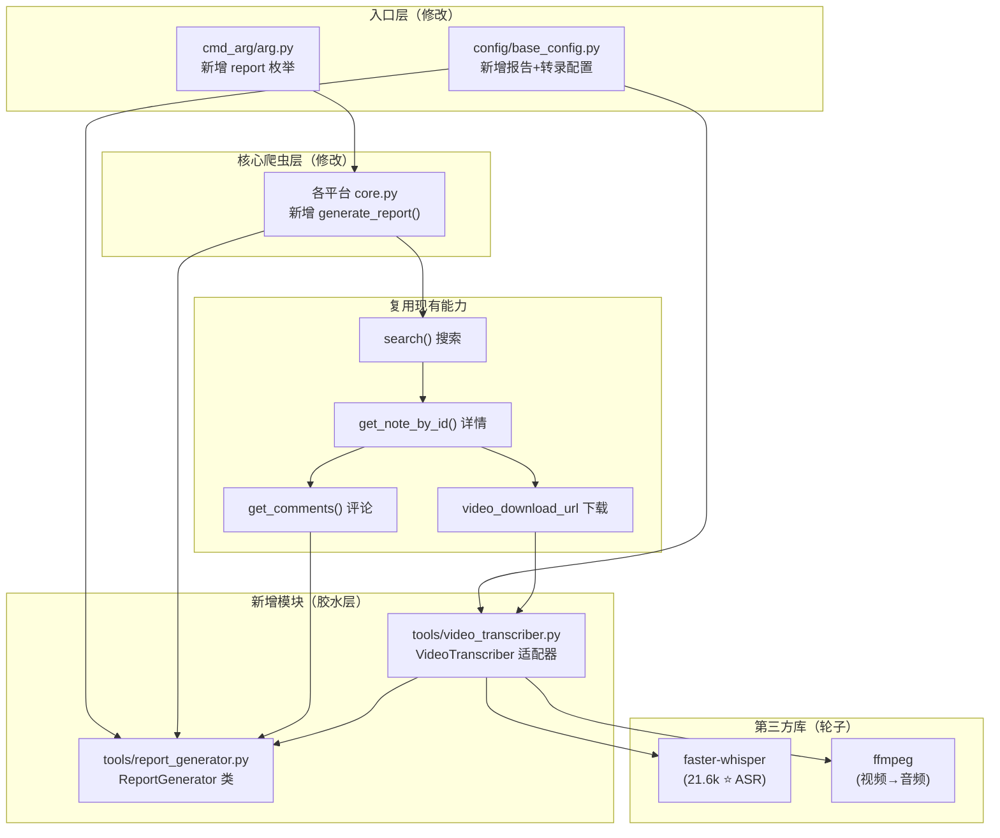
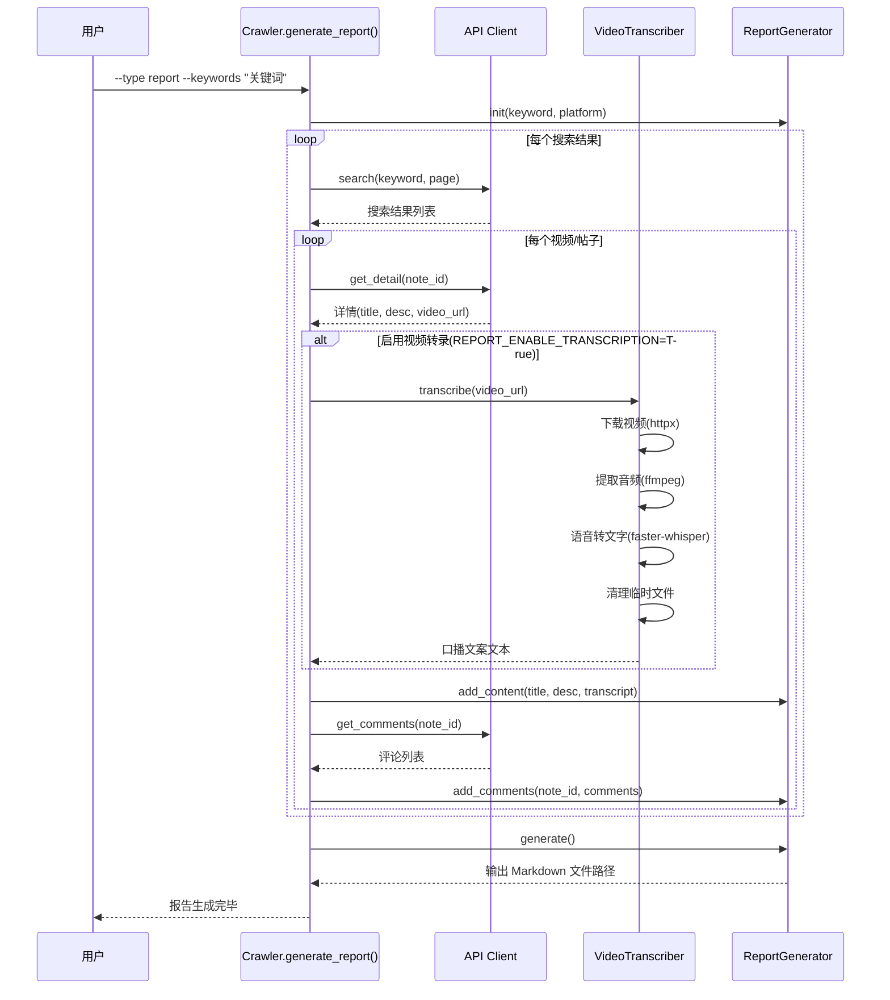

# Design: add-keyword-report

## 架构概述

新功能遵循项目四层架构 + 宪章胶水编程原则，复用已有搜索/评论能力，新增视频转录适配器：



## 核心设计决策

### 决策 1：ASR 引擎选择

| 候选方案 | Stars | 速度 | 内存 | 中文支持 | 结论 |
|----------|-------|------|------|----------|------|
| openai/whisper | 86k | 基准 | 高 | ✅ | ❌ 速度太慢 |
| **SYSTRAN/faster-whisper** | 21.6k | **4x 快** | **低** | ✅ | ✅ 选用 |
| huggingface/distil-whisper | 4k | 6x 快 | 低 | ⚠️ 英文为主 | ❌ 中文弱 |

**选择**：`faster-whisper` —— 基于 CTranslate2 的优化版 Whisper，速度快 4 倍，内存占用更小，pip 安装即用，中文转录效果等同原版。

### 决策 2：视频处理流水线

```
视频 URL → httpx 下载到临时文件 → ffmpeg 提取音频 (WAV) → faster-whisper 转文字 → 清理临时文件
```

**理由**：
- httpx 已是项目依赖，无需新增
- ffmpeg 是视频处理行业标准，提取音频稳定可靠
- WAV 格式无损，Whisper 识别效果最好
- 逐个处理 + 及时清理，避免磁盘积压

### 决策 3：转录开关设计

新增配置项 `REPORT_ENABLE_TRANSCRIPTION = True`（默认开启）：
- 当为 `True` 时，下载视频并转录口播文案
- 当为 `False` 时，仅使用标题+描述字段的文案（轻量模式，不需要 GPU/ffmpeg）
- 这样用户如果没有 GPU 或 ffmpeg，仍然可以使用基础的报告功能

### 决策 4：Whisper 模型大小

新增配置项 `WHISPER_MODEL_SIZE = "base"`：
- `tiny` - 最快，适合快速预览（39M）
- `base` - 默认推荐，速度/精度平衡（74M）
- `small` - 较精确（244M）
- `medium` - 高精度（769M）
- `large-v3` - 最高精度（1.5G，需要 GPU）

## 数据流



## VideoTranscriber 适配器设计（胶水层）

```python
class VideoTranscriber:
    """
    视频口播文案提取适配器
    
    胶水层：封装 faster-whisper + ffmpeg，提供统一的 transcribe() 接口。
    遵循宪章原则 I (胶水编程) 和 IV (模块化)。
    """

    def __init__(self, model_size: str = "base"):
        """初始化 Whisper 模型（惰性加载，首次调用时加载）"""

    async def transcribe(self, video_url: str) -> str:
        """
        从视频 URL 提取口播文案
        
        流水线：下载视频 → ffmpeg 提取音频 → Whisper 转文字 → 清理临时文件
        
        Returns:
            转录文本，失败时返回空字符串
        """

    async def _download_video(self, url: str, save_path: str) -> bool:
        """使用 httpx 下载视频到临时文件"""

    def _extract_audio(self, video_path: str, audio_path: str) -> bool:
        """使用 ffmpeg 从视频提取音频 (WAV 16kHz mono)"""

    def _transcribe_audio(self, audio_path: str) -> str:
        """使用 faster-whisper 将音频转为文字"""

    def _cleanup(self, *paths: str) -> None:
        """清理临时文件"""
```

## ReportGenerator 变更

在原有设计基础上，`ReportContentItem` 新增 `transcript` 字段：

```python
@dataclass
class ReportContentItem:
    content_id: str
    title: str
    desc: str
    transcript: str = ""  # 新增：视频口播转录文案
    # ... 其他字段不变
```

## 输出文档结构（更新）

```markdown
# 关键词内容报告：「{keyword}」

> 平台：{platform} | 时间：{datetime} | 共 {n} 条内容 | 共 {m} 条评论

---

## 1. {title_1}

- 作者：{nickname}
- 点赞：{likes} | 评论：{comments} | 分享：{shares}
- 链接：{url}

### 文案

{desc / content_text}

### 视频口播文案              ← 新增

{transcript from faster-whisper}

### 评论 ({count} 条)

| # | 用户 | 内容 | 点赞 | 时间 |
|---|------|------|------|------|
| 1 | user1 | comment text | 10 | 2026-03-20 |

---

## 数据统计摘要
...
```

## 配置扩展（完整）

```python
# ==================== Report Configuration ====================
REPORT_OUTPUT_DIR = ""
REPORT_MAX_COMMENTS_PER_NOTE = 0
REPORT_INCLUDE_AVATAR = False

# ==================== Video Transcription ====================
# 是否启用视频口播转录（需要 faster-whisper + ffmpeg）
REPORT_ENABLE_TRANSCRIPTION = True

# Whisper 模型大小: tiny/base/small/medium/large-v3
WHISPER_MODEL_SIZE = "base"

# ffmpeg 可执行文件路径（为空则使用系统 PATH 中的 ffmpeg）
FFMPEG_PATH = ""
```
