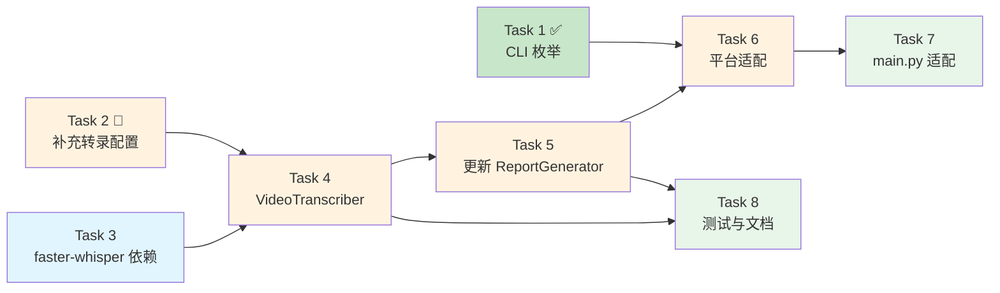

# Tasks: add-keyword-report

## 任务总览

基于胶水编程原则，将功能拆分为 8 个可验证的工作项。

---

## Task 1: 扩展 CLI 参数，新增 `report` 枚举 ✅ 已完成

**文件**：`cmd_arg/arg.py`
**状态**：已实现

---

## Task 2: 新增报告+转录配置项 ✅ 已完成（需补充转录配置）

**文件**：`config/base_config.py`

**变更**：
- ✅ `REPORT_OUTPUT_DIR`、`REPORT_MAX_COMMENTS_PER_NOTE`、`REPORT_INCLUDE_AVATAR`
- 🔲 新增 `REPORT_ENABLE_TRANSCRIPTION = True`
- 🔲 新增 `WHISPER_MODEL_SIZE = "base"`
- 🔲 新增 `FFMPEG_PATH = ""`

**依赖**：无

---

## Task 3: 新增 `faster-whisper` 依赖

**文件**：`requirements.txt`、`pyproject.toml`

**变更**：
- 新增 `faster-whisper>=1.0.0`

**验证**：
```bash
uv sync
uv run python -c "from faster_whisper import WhisperModel; print('OK')"
```

**依赖**：无（可并行）

---

## Task 4: 实现 VideoTranscriber 适配器（胶水层）

**文件**：`tools/video_transcriber.py`（新文件）

**变更**：
- 实现 `VideoTranscriber` 类：
  - `transcribe(video_url) -> str` — 完整流水线
  - `_download_video()` — httpx 下载
  - `_extract_audio()` — ffmpeg 提取音频
  - `_transcribe_audio()` — faster-whisper 转文字
  - `_cleanup()` — 清理临时文件
- 惰性加载模型（首次调用时加载）
- 支持配置 `WHISPER_MODEL_SIZE` 和 `FFMPEG_PATH`
- 失败时返回空字符串并记录日志，不中断主流程

**验证**：
```bash
uv run pytest tests/test_video_transcriber.py -v
```

**依赖**：Task 2 + Task 3

---

## Task 5: 更新 ReportGenerator，支持口播文案 ✅ 已创建（需更新）

**文件**：`tools/report_generator.py`

**变更**：
- `ReportContentItem` 新增 `transcript: str = ""` 字段
- `add_content()` 新增 `transcript` 参数
- `_build_content_section()` 新增「视频口播文案」段落
- 当 `transcript` 为空时不显示该段落

**依赖**：Task 4

---

## Task 6: 各平台 Crawler 新增 `generate_report()` 方法

**文件**：`media_platform/*/core.py`（7 个平台）、`base/base_crawler.py`

**变更**：
- `AbstractCrawler` 新增 `generate_report()` 默认方法
- 各平台 `start()` 中新增 `report` 分支
- `generate_report()` 流程：
  1. 搜索关键词 → 获取内容列表
  2. 每个内容获取详情（文案）
  3. 若启用转录，下载视频并提取口播文案
  4. 获取评论
  5. 数据传入 ReportGenerator → 生成文档

**实现策略**：先实现小红书(xhs)作为参考，其余按模式复制。

**依赖**：Task 4 + Task 5

---

## Task 7: 主入口 `main.py` 适配

**文件**：`main.py`

**变更**：report 模式下跳过 Excel flush 和词云生成

**依赖**：Task 6

---

## Task 8: 编写测试与文档

**文件**：
- `tests/test_report_generator.py`（新文件）
- `tests/test_video_transcriber.py`（新文件）
- `docs/报告生成功能说明.md`（新文件）

**依赖**：Task 4 + Task 5

---

## 任务依赖关系



**可并行**：Task 2(补充) 和 Task 3 可同时开始  
**关键路径**：Task 3 → Task 4 → Task 5 → Task 6 → Task 7  
**预估工时**：约 4-5 小时（含测试）
