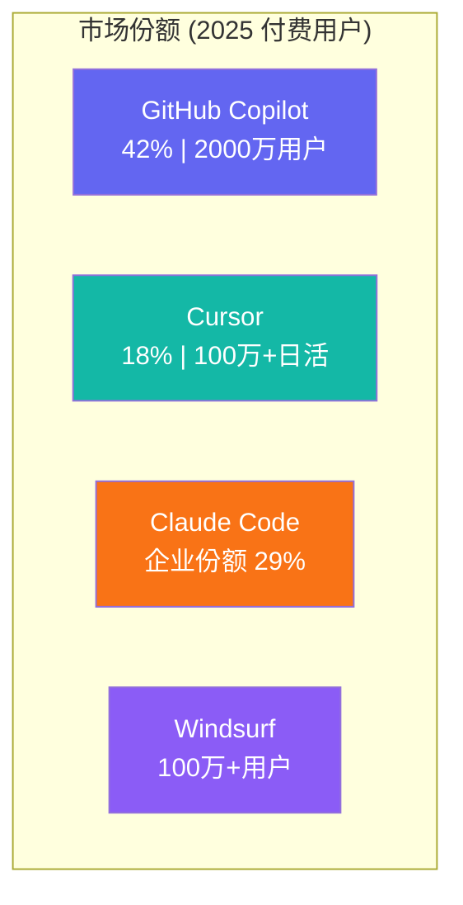
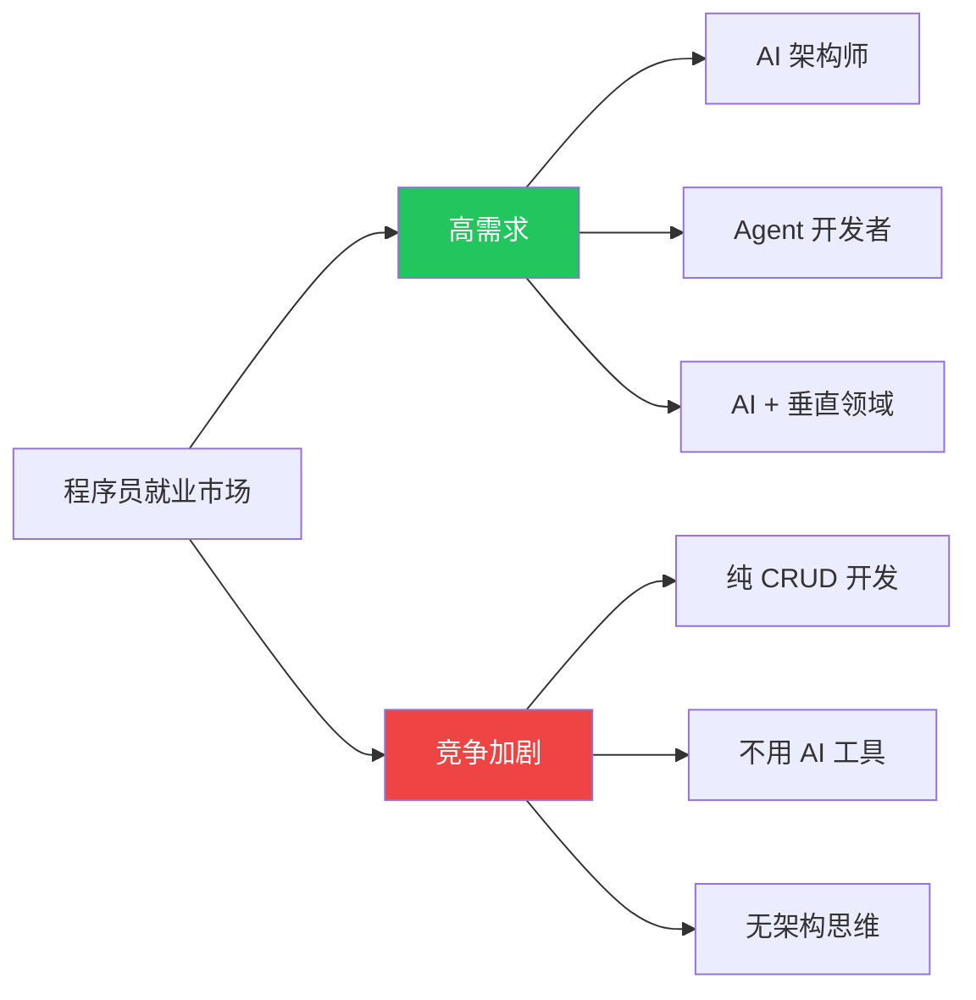

# AI 时代程序员学习方向深度分析

> 基于 GitHub 开源项目趋势 + 行业研究数据 + 市场薪资报告，2026 年 3 月更新

---

## 核心结论

AI 不会让程序员失业，但会**淘汰不会用 AI 的程序员**。

角色正从「代码工匠」→ 「**问题架构师 + AI 编排者**」转型。

---

## 一、市场数据：AI 编程工具爆发

### 📊 行业规模

| 指标 | 数据 | 来源 |
|:---|:---|:---|
| 2025 年 AI 编程工具市场规模 | **73.7 亿美元** | Mordor Intelligence |
| 2030 年预测市场规模 | **240 亿美元**（CAGR 26.6%） | Research and Markets |
| 2025 年开发者 AI 采用率 | **84%** 使用或计划使用 | Stack Overflow 2025 |
| 2026 Q1 开发者月活使用率 | **92.6%** | dev.to 调研 |
| AI 生成代码占比（Copilot 用户） | **46%**（2022 年仅 27%） | GitHub 2025 报告 |

### 🏆 四大 AI 编程工具对比



| 工具 | 用户量 | 年化收入 | 估值 | 核心优势 |
|:---|:---|:---|:---|:---|
| **GitHub Copilot** | 2000 万总用户 / 470 万付费 | — | 微软生态 | Fortune 100 中 90% 使用，IDE 内原生集成 |
| **Cursor** | 100 万+ 日活 / 36 万付费 | **20 亿美元** (2026.2) | ~500 亿美元 | AI-first 编辑器，RAG 语义搜索，增长最快 |
| **Claude Code** | 3000 万+ MAU (Claude 全线) | ~30 亿美元 (Claude 全线) | — | 强推理 + Agentic 自主编程，重构遗留代码最强 |
| **Windsurf** | 100 万+ 用户 | — | — | 声称 94% 代码由 AI 生成，对新手友好 |

> **关键洞察**：Cursor 仅用 18 个月就拿下 18% 付费市场份额，年化收入从 0 到 20 亿美元。这说明 **AI 编程工具已不再是"可选工具"，而是"核心生产力"**。

---

## 二、从 GitHub 趋势看行业风向

### 🔥 高星项目揭示的技能方向

| 方向 | 代表项目 | Stars | 你该学什么 |
|:---|:---|:---|:---|
| 开发者路线图 | [kamranahmedse/developer-roadmap](https://github.com/kamranahmedse/developer-roadmap) | **310k+** | 2025 版已新增 AI/ML 技能路径 |
| MCP 生态 | [appcypher/awesome-mcp-servers](https://github.com/appcypher/awesome-mcp-servers) | **5.2k** | 学 MCP 协议 = 掌握 AI Agent 连接万物的管道 |
| MCP 自动化 | [executeautomation/mcp-playwright](https://github.com/executeautomation/mcp-playwright) | **5.3k** | AI Agent + 浏览器自动化 = 新一代测试/爬虫 |
| AI Agent 指南 | [adongwanai/AgentGuide](https://github.com/adongwanai/AgentGuide) | **2.4k** | Agent 开发从概念到落地的系统化学习 |
| Vibe 编程规范 | [botingw/rulebook-ai](https://github.com/botingw/rulebook-ai) | **580** | Vibe Coding 转 Vibe Engineering 的最佳实践 |
| AI 编程学习 | [liyupi/ai-code-helper](https://github.com/liyupi/ai-code-helper) | **533** | 中文 AI 全栈开发实战教程 |
| Prompt 工程 | [dair-ai/Prompt-Engineering-Guide](https://github.com/dair-ai/Prompt-Engineering-Guide) | **55k+** | Prompt 工程权威指南 |
| 系统设计 | [donnemartin/system-design-primer](https://github.com/donnemartin/system-design-primer) | **290k+** | AI 替代不了的架构思维 |

### 📈 GitHub 增长最快的技术方向

```
🥇 MCP / AI Agent 互联        ████████████████████ 爆发增长
🥈 Vibe Coding 工程化          ███████████████      快速增长
🥉 LLM 应用 (RAG/Agent)       ██████████████       持续增长
4️⃣  AI 编程规范 + Rules        ████████████         新兴方向
5️⃣  传统框架 (React/Vue)      ████████             稳定增长
```

---

## 三、还需要学编程吗？

### ✅ 需要，但目的完全变了

| 过去学编程 | 现在学编程 |
|:---|:---|
| 自己手写所有代码 | **理解 AI 生成的代码** + 审查质量 |
| 记住 API 和语法 | **描述需求的能力**（Prompt） |
| 掌握一门语言 | **理解系统架构**，知晓各层如何协作 |
| 刷算法题面试 | **端到端问题解决能力** |
| 写 CRUD 业务 | **组装 AI Agent + 编排智能体** |

### ⚠️ AI "都会"不代表你不用学

> **类比**：计算器「都会」算数学，但数学家不会因此失业——因为**知道该算什么、结果对不对**才是核心价值。

**AI 的硬伤（开发者调研数据）**：

| 问题 | 数据 |
|:---|:---|
| 开发者不信任 AI 输出 | **66%** |
| AI 缺乏项目特定上下文 | **63%** |
| 幻觉问题 | 生成看似正确但有 bug 的代码 |
| 安全盲区 | 容易引入依赖漏洞、忽略边界情况 |
| 架构理解 | 无法理解整个业务系统的全局约束 |

---

## 四、2026 年该学什么？（优先级排序）

### 🥇 第一梯队：AI 时代必学

| 技能 | 为什么重要 | 怎么学 |
|:---|:---|:---|
| **Prompt Engineering** | 与 AI 高效协作的核心，Anthropic 开出 375 万美元/年 | [Prompt-Engineering-Guide (55k⭐)](https://github.com/dair-ai/Prompt-Engineering-Guide)，实操 Cursor/Claude Code |
| **系统设计 & 架构** | AI 替代不了全局视角，中高级工程师需求旺盛 | [system-design-primer (290k⭐)](https://github.com/donnemartin/system-design-primer) |
| **AI 工具链精通** | 开发效率的 10 倍乘数，已成为岗位标配 | 日常工作全面切换到 Cursor + Claude Code + Copilot |

### 🥈 第二梯队：竞争力加分

| 技能 | 为什么重要 | 怎么学 |
|:---|:---|:---|
| **MCP 协议 & Agent 开发** | AI 落地的关键管道，增长最快方向 | [awesome-mcp-servers (5.2k⭐)](https://github.com/appcypher/awesome-mcp-servers)，自己搭 MCP Server |
| **代码审查能力** | 66% 开发者不信任 AI 输出，审查成为核心价值 | 参与开源 PR Review，学 [AgentGuide (2.4k⭐)](https://github.com/adongwanai/AgentGuide) |
| **RAG + LLM 应用开发** | 企业 AI 落地最常见需求 | 实战向量数据库 + LangChain/LlamaIndex |

### 🥉 第三梯队：长期价值

| 技能 | 说明 |
|:---|:---|
| **产品思维** | 技术 × 业务 = 真正的不可替代性 |
| **垂直领域 AI** | 医疗+AI、金融+AI、法律+AI 的深度结合 |
| **AI 安全 & 伦理** | 模型安全审计、对抗性测试将成为新职业 |

---

## 五、就业市场与薪资数据

### 💰 国内薪资（2025-2026）

| 岗位 | 经验 | 年薪范围 |
|:---|:---|:---|
| 普通开发（一线城市） | 0-3 年 | 20-35 万 |
| 普通开发（一线城市） | 3-5 年 | 30-50 万 |
| 普通开发（一线城市） | 5 年+ | 40-70 万+ |
| **大模型算法工程师** | 3 年+ | **50-200 万** |
| **AI 垂直领域专家**（金融风控等） | 5 年+ | **80-150 万** |
| **Prompt 工程师** | — | 月薪 15K-50K |

### 💰 海外薪资（对比参考）

| 岗位 | 公司 | 年薪 |
|:---|:---|:---|
| Prompt Engineer | OpenAI | **150 万美元** |
| Prompt Engineer | Anthropic | **375 万美元** |
| AI/ML Engineer | 硅谷大厂 | 30-60 万美元 |

### 📊 就业市场两极分化



> **Gartner 预测**：到 2026 年，全球 **70% 的新应用**将通过低代码/无代码构建。纯手写代码的需求持续下降。

---

## 六、怎么学？

### 🎯 学习路径（不再像过去那样"先学语法再做项目"）

```
┌─────────────────────────────────────────────────────┐
│              AI 时代学习路径 (2026版)                  │
├─────────────────────────────────────────────────────┤
│                                                     │
│  1. 工具先行 → 立刻上手 AI 编程工具 (第 1 周)         │
│     └── 安装 Cursor + Copilot + Claude Code          │
│                                                     │
│  2. 基础粗学 → 用 AI 辅助快速入门 (第 2-4 周)         │
│     └── Python/JS 基础，边做项目边学                  │
│                                                     │
│  3. 实战为王 → AI 辅助做完整项目 (第 2-3 月)          │
│     └── 全栈项目 / SaaS 产品 / 自动化工具             │
│                                                     │
│  4. 深入壁垒 → 学 AI 搞不定的 (第 3-6 月)            │
│     └── 架构设计 / 性能优化 / 安全 / code review     │
│                                                     │
│  5. 专精方向 → AI + 垂直领域 (6 月+)                  │
│     └── MCP Agent / RAG 应用 / AI + 金融/医疗/教育    │
│                                                     │
└─────────────────────────────────────────────────────┘
```

### 📌 每日/每周/每月行动清单

| 频率 | 行动 | 目的 |
|:---|:---|:---|
| **立刻做** | 安装 Cursor + Claude Code | 体验 Vibe Coding |
| **每天** | 用 AI 写代码 + review AI 输出 | 建立 AI 协作肌肉记忆 |
| **每周** | 读 1 个高星项目 README | 理解行业趋势和架构思路 |
| **每月** | 学 1 个新概念（MCP/RAG/Agent） | 保持技能前沿 |
| **每季度** | 做 1 个完整项目并部署 | 积累端到端经验 |
| **持续** | 参与开源 + 练 Code Review | 建立行业声誉 |

---

## 七、不同身份的建议

| 身份 | 策略 |
|:---|:---|
| **在职开发者** | 立刻将 AI 工具融入日常工作流，重点提升架构和 Review 能力 |
| **转行者** | 先学 AI 工具 → Vibe Coding 做原型 → 再补系统设计知识 |
| **学生** | 编程基础要学，但重心放在 AI 协作 + 系统思维，而非手写算法 |
| **创业者** | 用 AI 快速验证 MVP，1 个人+AI = 过去 3-5 人团队的产出 |
| **独立开发者** | 黄金时代！用 AI 工具一个人做出完整产品推向市场 |

---

## 八、关键引用的 GitHub 项目

| 项目 | Stars | 用途 |
|:---|:---|:---|
| [developer-roadmap](https://github.com/kamranahmedse/developer-roadmap) | 310k+ | 开发者学习路线图（含 AI 路径） |
| [system-design-primer](https://github.com/donnemartin/system-design-primer) | 290k+ | 系统设计面试宝典 |
| [Prompt-Engineering-Guide](https://github.com/dair-ai/Prompt-Engineering-Guide) | 55k+ | Prompt 工程权威指南 |
| [awesome-mcp-servers](https://github.com/appcypher/awesome-mcp-servers) | 5.2k | MCP 服务器生态合集 |
| [mcp-playwright](https://github.com/executeautomation/mcp-playwright) | 5.3k | AI Agent + 浏览器自动化 |
| [AgentGuide](https://github.com/adongwanai/AgentGuide) | 2.4k | AI Agent 开发系统化指南 |
| [rulebook-ai](https://github.com/botingw/rulebook-ai) | 580 | Vibe Coding 转工程化规范 |
| [ai-code-helper](https://github.com/liyupi/ai-code-helper) | 533 | AI 编程助手实战（中文） |

---

> **一句话总结**：AI 时代学编程，不是为了跟 AI 比谁写代码快，而是成为**那个告诉 AI 该做什么、检查它做得对不对、并把它的能力编排成产品的人**——这就是未来 10 年最值钱的能力。
