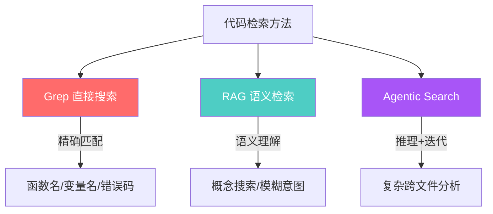
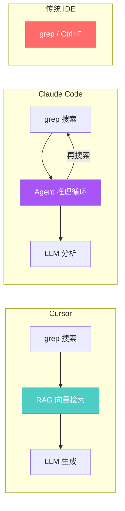

# RAG vs 直接搜索（Agentic Grep）对比分析

> 以 Cursor（RAG 内置）和 Claude Code（grep + agentic 推理）为典型案例

---

## 一句话结论

**RAG 擅长"找相关的"，直接搜索擅长"找精确的"，Agentic Search 是两者的融合进化体。**

---

## 三种方法对比总览



---

## 详细对比

### 1. Grep 直接搜索（Claude Code 的基础方式）

Claude Code 底层依赖 `grep_search`、`find_by_name` 等工具直接检索代码。

| 维度 | 说明 |
|:---|:---|
| **原理** | 字面匹配 / 正则匹配，遍历文件内容 |
| **典型命令** | `grep -rn "functionName" src/` |

**✅ 优点**

| 优点 | 说明 |
|:---|:---|
| 极速精准 | 查函数名、变量名、错误码，0 延迟 |
| 零幻觉 | 结果就是代码本身，不存在"编造"可能 |
| 无需预处理 | 不需要建向量索引、不需要 embedding |
| 可预测 | 同样的查询永远返回同样的结果 |
| 成本极低 | 不消耗 LLM tokens（检索阶段） |

**❌ 缺点**

| 缺点 | 说明 |
|:---|:---|
| 无语义理解 | 搜 "用户认证" 找不到 `authenticate()` |
| token 膨胀 | 大量不相关匹配塞满上下文窗口 |
| 噪声多 | monorepo 下 `node_modules` 等会污染结果 |
| 无法模糊搜索 | 不知道确切名称时束手无策 |
| 无法跨概念关联 | 找不到"这个接口的调用链都有哪些" |

---

### 2. RAG 语义检索（Cursor 的内置方式）

Cursor 通过 `@Codebase` 命令触发 RAG，将代码库预先 embedding 为向量索引。

| 维度 | 说明 |
|:---|:---|
| **原理** | 代码 → 向量化 → 向量数据库 → 余弦相似度检索 → Top-K 结果送入 LLM |
| **典型触发** | `@Codebase 这个项目的认证逻辑在哪里？` |

**✅ 优点**

| 优点 | 说明 |
|:---|:---|
| 语义理解 | "用户登录流程"能找到 `auth.ts`、`session.ts`、`middleware.ts` |
| 模糊意图友好 | 不需知道精确名称，描述概念即可 |
| 上下文紧凑 | 只返回语义最相关的片段，token 利用率高 |
| 跨文件关联 | 能发现概念上相关但文件名/函数名无关的代码 |
| 混合搜索 | 2025+ 的 RAG 通常结合 BM25 关键词 + 向量语义 |

**❌ 缺点**

| 缺点 | 说明 |
|:---|:---|
| 需要预索引 | 首次使用需 embedding 整个代码库（耗时） |
| 分块（chunking）难题 | 代码切分不当会丢失上下文或拆散一个函数 |
| 索引可能过时 | 修改代码后索引不实时更新 → 检索到旧版本 |
| 可能遗漏精确匹配 | 向量相似度不保证字面精确，可能漏掉 |
| 成本更高 | embedding 计算 + 向量数据库存储 |
| 幻觉风险 | LLM 可能基于"相似但不正确"的检索结果编造 |

---

### 3. Agentic Search（Claude Code 的实际工作方式）

Claude Code 虽然底层用 grep，但上层有 **Agent 推理循环**：规划 → 搜索 → 分析 → 再搜索 → 综合。

| 维度 | 说明 |
|:---|:---|
| **原理** | LLM Agent 多轮推理 + 动态调用多种工具（grep、file outline、view code item 等） |
| **典型流程** | 先搜关键词 → 看文件结构 → 定位代码 → 阅读上下文 → 跨文件追踪 |

**✅ 优点**

| 优点 | 说明 |
|:---|:---|
| 动态自适应 | 第一次搜不到会自动换关键词、换策略 |
| 多工具组合 | grep + file tree + code outline + view file 联动 |
| 深度推理 | 可以追踪调用链、理解架构、发现隐式依赖 |
| 无需预建索引 | 即时搜索，不依赖预处理 |
| 复杂问题更强 | 跨多个文件/模块的问题表现优于纯 RAG |

**❌ 缺点**

| 缺点 | 说明 |
|:---|:---|
| 慢且贵 | 多轮 LLM 调用 = 更多 tokens + 更多延迟 |
| 取决于 Agent 能力 | Agent 推理能力差 → 搜索策略差 → 结果差 |
| 不可预测 | 同一问题可能走不同搜索路径，结果略有差异 |
| 仍有盲区 | 如果一开始方向错了可能越搜越偏 |

---

## 三者对比速查表

| 维度 | Grep 直接搜索 | RAG 语义检索 | Agentic Search |
|:---|:---|:---|:---|
| **精确匹配** | ⭐⭐⭐⭐⭐ | ⭐⭐ | ⭐⭐⭐⭐ |
| **语义理解** | ⭐ | ⭐⭐⭐⭐⭐ | ⭐⭐⭐⭐ |
| **速度** | ⭐⭐⭐⭐⭐ | ⭐⭐⭐ | ⭐⭐ |
| **成本** | ⭐⭐⭐⭐⭐ (最低) | ⭐⭐⭐ | ⭐⭐ (最高) |
| **复杂问题** | ⭐ | ⭐⭐⭐ | ⭐⭐⭐⭐⭐ |
| **幻觉风险** | 无 (只返回原文) | 中等 | 低 (多轮验证) |
| **需要预处理** | 否 | 是 (建索引) | 否 |
| **跨文件理解** | ⭐ | ⭐⭐⭐ | ⭐⭐⭐⭐⭐ |

---

## 实际工具映射



| 工具 | 主要方法 | 辅助方法 |
|:---|:---|:---|
| **VS Code (原生)** | Grep | 无 |
| **Cursor** | RAG (向量 + BM25) | Grep |
| **Claude Code** | Agentic (Agent + Grep) | 无内置 RAG |
| **GitHub Copilot** | RAG (代码上下文) | Grep |
| **Windsurf** | RAG | Grep |

---

## 什么场景该用什么？

| 场景 | 最佳方法 | 为什么 |
|:---|:---|:---|
| 查找特定函数/变量 | **Grep** | 精确匹配最快最准 |
| "这个项目怎么处理身份认证的？" | **RAG** | 需要语义理解 |
| 跨 10 个文件追踪一个 bug | **Agentic** | 需要多轮推理和策略调整 |
| 代码审查 | **Agentic** | 需要理解意图 + 检查细节 |
| 快速原型开发 | **RAG** | 快速获取相关代码参考 |
| 大型重构 | **Agentic** | 需要全局理解 + 精确修改 |
| 查找错误日志来源 | **Grep** | 精确字符串匹配 |

---

## 趋势判断（2025-2026）

```
┌────────────────────────────────────────────────┐
│               代码检索方法演进                    │
│                                                │
│  2020  ────  grep / Ctrl+F                     │
│              (纯文本匹配)                       │
│                                                │
│  2023  ────  RAG (向量语义检索)                  │
│              (Cursor / Copilot 兴起)            │
│                                                │
│  2025  ────  Agentic RAG (两者融合)              │
│              (Claude Code / Agent 框架)         │
│                                                │
│  2026+ ────  Multi-Modal Agentic Search         │
│              (代码+图+文档+运行时数据 联合检索)   │
│                                                │
└────────────────────────────────────────────────┘
```

**核心趋势**：
1. **融合而非替代** — 未来方案会把 grep + RAG + Agent 推理三者组合
2. **MCP 统一接口** — 通过 Model Context Protocol 让 Agent 接入任意数据源
3. **上下文管理** — 智能选取最相关信息而非暴力全量灌入
4. **成本下降** — 模型推理成本持续降低，Agentic Search 将更普及

---

> **一句话**：不是"RAG 还是 Grep"的选择题，而是**"什么时候用精确刀、什么时候用语义网、什么时候让 Agent 自己想"**的判断力问题——这本身就是 AI 时代程序员的核心竞争力。
