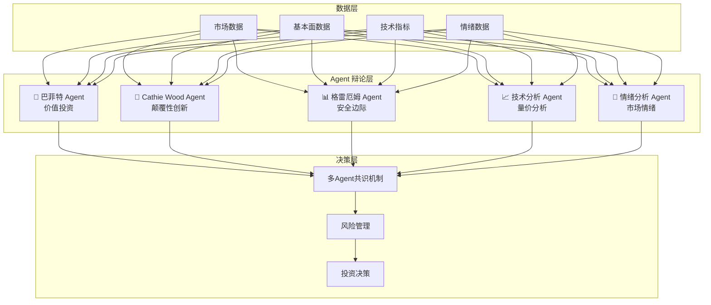

# GitHub 开源 AI 加密货币预测项目深度调研报告

> **调研日期**: 2026年3月16日  
> **数据来源**: GitHub 搜索、Web 综合调研  
> **目标**: 寻找能聚合市场全量数据、AI 持续分析并实现高正确率预测的开源项目

---

## 核心结论

> [!IMPORTANT]
> **没有任何开源项目能"稳定高正确率"预测加密货币价格。** 但以下项目通过多维数据聚合、自适应学习、多Agent辩论等机制，代表了当前 AI 预测领域的最高水平。其中 **Freqtrade + FreqAI** 和 **virattt/ai-hedge-fund** 是最值得关注的两个项目。

---

## 第一梯队：成熟度高、社区活跃、可实战部署

### 1. 🏆 Freqtrade + FreqAI — 自适应机器学习交易

| 属性 | 详情 |
|------|------|
| **仓库** | [freqtrade/freqtrade](https://github.com/freqtrade/freqtrade) |
| **Stars** | **39,900+** ⭐⭐⭐⭐⭐ |
| **语言** | Python |
| **核心能力** | 策略开发 + 回测 + 实盘 + 机器学习预测 |
| **数据聚合** | 通过 CCXT 接入 15+ 交易所，获取全量 OHLCV 数据 |
| **AI 模块** | FreqAI — 自适应预测建模引擎 |

#### 为什么它最值得关注

```
数据采集 → CCXT (15+ 交易所)
    ↓
特征工程 → 自定义技术指标 + 基本面特征
    ↓
模型训练 → FreqAI (LSTM/XGBoost/LightGBM/CatBoost)
    ↓
持续再训练 → 自动以实时数据滚动更新模型
    ↓
信号生成 → 自适应调整买卖信号
    ↓
执行交易 → 自动化实盘交易
```

**FreqAI 核心特性**：
- **自适应持续学习**：不是一次训练永久使用，而是不断用最新数据重新训练模型
- **多模型支持**：LSTM、XGBoost、LightGBM、CatBoost、PyTorch 自定义模型
- **防过拟合**：内置交叉验证和数据分裂机制
- **可集成外部数据**：支持添加链上数据、情绪数据等外部特征

**相关进阶项目**：

| 仓库 | Stars | 描述 |
|------|-------|------|
| [FreqAI-Marcos-Lopez-De-Prado](https://github.com/markdregan/FreqAI-Marcos-Lopez-De-Prado) | 84 | 基于《金融机器学习进阶》的量化策略实现 |

---

### 2. 🏆 virattt/ai-hedge-fund — 多 Agent AI 对冲基金

| 属性 | 详情 |
|------|------|
| **仓库** | [virattt/ai-hedge-fund](https://github.com/virattt/ai-hedge-fund) |
| **Stars** | **高关注度（社区热门项目）** |
| **语言** | Python |
| **核心能力** | 多 AI Agent 模拟对冲基金团队进行投资决策 |
| **特色** | 模拟巴菲特、Cathie Wood、格雷厄姆等多位投资大师的投资风格 |

#### 架构亮点



**为什么值得关注**：
- **多视角分析**：不同 Agent 代表不同投资哲学，比单一模型更具鲁棒性
- **LLM 驱动**：利用大语言模型理解复杂的市场动态和新闻
- **辩论机制**：Agent 之间的辩论过程可以过滤单一偏见
- **教育价值**：即使不用于实盘，也是学习 AI 投资逻辑的绝佳资源

> [!WARNING]
> 该项目明确声明为概念验证（PoC），不适合直接用于真实交易。

**关联项目**：[virattt/dexter](https://github.com/virattt/dexter) — 自主金融 AI 研究 Agent

---

### 3. OctoBot — AI + 多策略交易平台

| 属性 | 详情 |
|------|------|
| **仓库** | [Drakkar-Software/OctoBot](https://github.com/Drakkar-Software/OctoBot) |
| **Stars** | **4,000+** ⭐⭐⭐⭐ |
| **语言** | Python |
| **核心能力** | 40+ 预设策略 + AI 连接器 + 社交指标分析 |
| **数据聚合** | 15+ 交易所 + Google Trends + Reddit |

**核心特色**：
- **AI 连接器**：可接入 OpenAI / Ollama 等 LLM 辅助交易决策
- **社交指标**：内置分析 Google Trends、Reddit 等社交数据源
- **Tentacles 插件系统**：高度可扩展的模块化架构
- **Web UI**：提供可视化操作界面

**进阶版本**：

| 仓库 | 描述 |
|------|------|
| [Drakkar-Software/OctoBot-AI](https://github.com/Drakkar-Software/OctoBot-AI) | 多 Agent 加密 AI 对冲基金框架 — 涵盖数据分析到实盘交易的完整链路 |

---

### 4. NautilusTrader — 高性能算法交易平台

| 属性 | 详情 |
|------|------|
| **仓库** | [nautechsystems/nautilus_trader](https://github.com/nautechsystems/nautilus_trader) |
| **Stars** | **9,100+** ⭐⭐⭐⭐ |
| **语言** | Python / Rust |
| **核心能力** | 低延迟、事件驱动、AI-Ready 的算法交易平台 |

**为什么适合 AI 预测**：
- 事件驱动架构，适合实时 ML 模型推理
- Python/Rust 混合架构保证了性能
- 原生支持回测和实盘切换
- 设计上为 ML 模型集成预留了接口

---

## 第二梯队：聚焦特定场景的预测项目

### 5. AI-Powered-Crypto-Signal-Prediction-Platform

| 属性 | 详情 |
|------|------|
| **仓库** | [mian-owais/AI-Powered-Crypto-Signal-Prediction-Platform](https://github.com/mian-owais/AI-Powered-Crypto-Signal-Prediction-Platform) |
| **核心能力** | 实时预测 + RL 自学习 Agent + 评估面板 |

**亮点**：
- **强化学习 Agent**：能自我学习市场模式
- **滚动准确率追踪**：不是静态准确率，而是持续追踪模型的预测准确率变化
- **全面评估指标**：Accuracy / Precision / Recall / F1-Score
- **多时间框架**：日级、周级预测

---

### 6. ultimate-crypto-trading-bot — 多数据源融合分析

| 属性 | 详情 |
|------|------|
| **仓库** | [Arash-Mansourpour/ultimate-crypto-trading-bot](https://github.com/Arash-Mansourpour/ultimate-crypto-trading-bot) |
| **语言** | Python |
| **核心特色** | 多源数据 + 技术指标 + 链上指标 + 社交情绪 + AI 信号 |

**数据整合维度**：

| 数据类型 | 包含指标 |
|---------|---------|
| 技术分析 | Heiken Ashi、一目均衡表、斐波那契、MACD、RSI、OBV |
| 链上指标 | On-chain Metrics（链上交易数据） |
| 社交情绪 | Social Sentiment 分析 |
| AI 信号 | AI-Powered 综合信号生成 |
| 风险管理 | 内置风险管理模块 |

---

### 7. bnbchain-mcp — AI Agent 的 MCP 工具集

| 属性 | 详情 |
|------|------|
| **仓库** | [nirholas/bnbchain-mcp](https://github.com/nirholas/bnbchain-mcp) |
| **Stars** | 15 |
| **语言** | TypeScript |
| **核心能力** | 为 AI Agent 提供 DeFi / 链上数据的 MCP 工具集 |

**为什么值得关注**：
- 基于 MCP 协议，可被 Claude / Copilot 等 AI 直接调用
- 涵盖 DEX 交换、价格预言机、市场数据、协议分析
- 蜜罐检测、安全分析等防骗功能
- 代表了 **AI Agent + Crypto** 融合的最新方向

---

### 8. Jesse — 策略研究与回测框架

| 属性 | 详情 |
|------|------|
| **仓库** | jesse-ai/jesse |
| **语言** | Python |
| **核心能力** | 策略研究、回测、实盘执行 |

**AI 相关特色**：
- **Optimize Mode**：自动优化策略参数
- **JesseGPT**：AI 助手辅助策略开发和调试

---

## 第三梯队：学术研究型价格预测

| 仓库 | Stars | 方法 | 数据源 |
|------|-------|------|--------|
| [sudharsan13296/Bitcoin-price-Prediction-using-LSTM](https://github.com/sudharsan13296/Bitcoin-price-Prediction-using-LSTM) | 127 | LSTM RNN | 历史价格 |
| [manthanthakker/BitcoinPrediction](https://github.com/manthanthakker/BitcoinPrediction) | 98 | ARIMA + RNN | 价格 + Reddit + Yahoo |
| [emirhanai/Cryptocurrency-Prediction-V3.0-GRU](https://github.com/emirhanai/Cryptocurrency-Prediction-with-Artificial-Intelligence-V3.0-GRU-Neural-Network) | 53 | GRU 神经网络 | Binance 数据 |
| [Hayder-IRAQ/BTCPredictor](https://github.com/Hayder-IRAQ/BTCPredictor) | 新项目 | LSTM + Transformer + FinBERT | 价格 + 新闻情绪 |
| [falaybeg/LSTM-Bitcoin-GoogleTrends](https://github.com/falaybeg/LSTM-Bitcoin-GoogleTrends-Prediction) | 39 | LSTM + Google Trends | 价格 + 搜索趋势 |

---

## 综合推荐矩阵

| 项目 | 数据全面性 | AI 能力 | 持续学习 | 可实战 | 社区活跃 | 推荐指数 |
|------|-----------|---------|---------|--------|---------|---------|
| **Freqtrade + FreqAI** | ⭐⭐⭐⭐ | ⭐⭐⭐⭐⭐ | ✅ 自适应 | ✅ 实盘 | ⭐⭐⭐⭐⭐ | **🥇 95/100** |
| **virattt/ai-hedge-fund** | ⭐⭐⭐⭐ | ⭐⭐⭐⭐⭐ | ❌ | ❌ PoC | ⭐⭐⭐⭐ | **🥈 88/100** |
| **OctoBot** | ⭐⭐⭐⭐ | ⭐⭐⭐⭐ | ⚠️ 部分 | ✅ 实盘 | ⭐⭐⭐⭐ | **🥉 85/100** |
| **NautilusTrader** | ⭐⭐⭐ | ⭐⭐⭐⭐ | ❌ 需自建 | ✅ 实盘 | ⭐⭐⭐⭐ | **82/100** |
| **ultimate-crypto-bot** | ⭐⭐⭐⭐⭐ | ⭐⭐⭐ | ❌ | ⚠️ | ⭐⭐ | **75/100** |
| **AI-Signal-Platform** | ⭐⭐⭐ | ⭐⭐⭐⭐ | ✅ RL | ⚠️ | ⭐⭐ | **72/100** |

---

## 关键洞察：为什么"高正确率"目标难以实现

> [!CAUTION]
> **加密货币市场的本质特性决定了没有任何模型能实现持续高正确率预测**

| 挑战 | 说明 |
|------|------|
| **非线性和混沌** | 加密市场受 FUD/FOMO、鲸鱼操纵、监管突变等非线性因素主导 |
| **数据漂移** | 市场模式不断变化，历史数据训练的模型会快速失效 |
| **黑天鹅事件** | LUNA 崩盘、FTX 破产等不可预测事件频发 |
| **过拟合陷阱** | 回测准确率 90%+ 的策略实盘往往亏损 |
| **信息不对称** | 内幕交易、做市商操纵等信息散户无法获取 |

**最优实践是**：
1. 使用 **FreqAI 的自适应持续学习** 对抗数据漂移
2. 使用 **多 Agent 辩论机制**（如 ai-hedge-fund）减少单一模型偏见
3. **融合多维数据**（技术面 + 链上 + 情绪 + 基本面）
4. **严格的风险管理**比高准确率更重要
5. 将 AI 预测视为**辅助信号**而非绝对指令

---

*调研完成于 2026年3月16日 17:31 CST*
