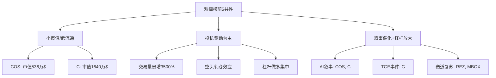

# 2026年3月16日币安涨幅榜前五币种上涨原因深度分析

> **研究日期**: 2026年3月16日  
> **数据来源**: Binance、CoinMarketCap、CoinGecko、GitHub、各项目官网  
> **分析维度**: 宏观环境、基本面、技术面、链上数据、市场微观结构、GitHub开发活跃度

---

## 摘要

2026年3月16日，币安（Binance）涨幅榜前五位分别为：**Contentos (COS) +118.06%**、**Chainbase (C) +50.45%**、**Gravity by Galxe (G) +33.41%**、**Renzo (REZ) +27.83%**、**MOBOX (MBOX) +23.36%**。本文从宏观经济背景、项目基本面、技术分析、市场微观结构、链上行为及 GitHub 开发活跃度六个维度，系统性分析各币种上涨的驱动因素，并揭示其中的共性规律与潜在风险。

研究发现，本次涨幅榜前五存在三个显著共性特征：(1) 均为小市值代币，极易受流动性驱动产生超额波动；(2) 多数伴随"空头轧仓"（Short Squeeze）现象；(3) 上涨更多由投机性资金和事件催化驱动，而非基本面改善。值得警惕的是，COS 和 MBOX 均已被币安标记为"Monitoring Tag"（监控标签），面临潜在下架风险。

---

## 第一章 宏观市场环境分析

### 1.1 加密市场整体态势

2026年3月中旬，全球加密市场呈现以下关键特征：

| 指标 | 数值 | 含义 |
|------|------|------|
| 加密货币总市值 | 2.54万亿美元 | 较历史高点有一定回落 |
| 24小时交易量 | 769亿美元 | 活跃度中等偏高 |
| BTC 主导率 | 56.9% - 58.6% | 资金集中于BTC，山寨币弱势 |
| ETH 市场占比 | 10.3% | ETH相对弱势 |
| 恐惧与贪婪指数 | 10-19（极度恐惧） | 市场情绪极度悲观 |
| 山寨季指数 | 27-35 | 远低于75阈值，处于"BTC季" |

### 1.2 关键宏观事件

- **美联储FOMC会议**（3月17-18日）即将召开，市场预期仅2次降息，首次不早于6月
- **比特币第2000万枚**于3月11-15日被挖出，强化稀缺性叙事
- **BTC突破73,000美元**，日内涨幅2.21%，周涨幅9.7%
- **代币解锁潮**：本周解锁总额超4.38亿美元（含 ZRO、BARD、RIVER）
- **稳定币净流入**为正值，叠加美国退税季，提供增量流动性

### 1.3 宏观环境对涨幅榜的影响

在"极度恐惧"的市场情绪下，大盘蓝筹币普遍横盘或微涨，而**高波动小市值代币反而容易因少量资金流入产生异常涨幅**。这是本次涨幅榜前五均为小市值币的根本宏观背景——在 BTC 吸走主要流动性后，剩余投机资金集中涌入少数标的，制造了极端行情。

---

## 第二章 逐币深度分析

### 2.1 Contentos (COS) — 涨幅 +118.06%

#### 2.1.1 项目概述

Contentos 是一个基于区块链的去中心化内容生态系统，旨在通过区块链激励机制赋能内容创作者和消费者。项目运行于 Binance Beacon Chain 之上，采用 saBFT（自适应BFT）共识机制。

| 基本面指标 | 数值 |
|-----------|------|
| 总供应量 | ~99.2亿 COS |
| 流通供应量 | ~51.7-52亿 COS |
| 市值 | 约536万-1191万美元（高度波动） |
| 所属赛道 | 内容生态 / AI（新叙事） |

#### 2.1.2 上涨催化剂

**（1）鲸鱼（Whale）大规模买入**  
3月15日数据显示，COS 交易量暴增 **3500%以上**，大额钱包出现快速积累行为。鲸鱼的战略性买入直接引发了价格快速上涨。

**（2）空头轧仓（Short Squeeze）**  
3月14日，COS 出现典型的"流动性驱动拉盘"，覆盖了此前的看空叙事。交易量24小时内暴涨超150%，做空方被迫平仓买入，形成正反馈循环。

**（3）AI 叙事催化**  
- Contentos 于2025年12月发布 **TradeyAI** 新产品，计划2026年初上线
- 即将推出 AI "New Partner" 训练与揭晓活动
- AI 概念在2026年依然是最强叙事之一

**（4）代币回购计划**  
Contentos 计划在2026年继续执行 COS 回购销毁计划（首次于2025年10月执行），减少流通供应。

#### 2.1.3 风险警示

> [!CAUTION]
> **2026年3月7日，币安已将 COS 列入"Monitoring Tag"（监控标签）**，意味着该项目因流动性低、开发活跃度弱或项目不稳定等原因，面临下架风险。投资者应高度警惕。

#### 2.1.4 GitHub 开发活跃度

| 仓库 | 语言 | Stars | 最近更新 |
|------|------|-------|---------|
| coschain/cos-android-sdk | Java | 1 | 2019-12 |
| coschain/cosdart | Dart | 1 | 2023-10 |
| coschain/cos-java-sdk | Java | 0 | 2022-02 |
| coschain/cos-ios-sdk | C | 0 | 2019-07 |

> [!WARNING]
> Contentos 的 GitHub 开发活跃度**极低**，核心 SDK 仓库均已多年未更新，与其 AI 叙事形成鲜明反差。这进一步印证了本次暴涨更多是投机驱动而非基本面改善。

---

### 2.2 Chainbase (C) — 涨幅 +50.45%

#### 2.2.1 项目概述

Chainbase 定位为"为 AI 时代打造的超级数据网络"（Hyperdata Network），旨在将所有区块链数据整合进统一生态系统，提供透明、无许可的数据互操作层。

| 基本面指标 | 数值 |
|-----------|------|
| 市值 | 约1640万美元（微型市值） |
| 所属赛道 | AI + 数据基础设施 |
| 战略投资方 | 腾讯（Tencent） |

#### 2.2.2 上涨催化剂

**（1）主网上线——从测试网到正式网络**  
Chainbase 的 Hyperdata Network 完成了从测试网到**2026主网**的过渡。基础设施栈（含 EVM Tracer、Manuscript、WalruS3、x402 集成）走向成熟。主网上线是区块链项目最重大的里程碑事件。

**（2）AI 时代的定位叙事**  
- 发布 Chainbase AI 文档体系
- 集成 Agentic Layers for DeFi（去中心化金融代理层）
- "为AI服务的数据层"叙事在2026年Q1持续强劲

**（3）腾讯战略投资背书**  
腾讯的投资为项目提供了信誉背书和资源支持，增强了市场信心。

**（4）空头轧仓**  
该轮上涨中，大量空单被强制平仓。RSI 一度达到 **88.435**，处于严重超买区域。

#### 2.2.3 风险因素

- **微型市值**（1640万美元），极易被操纵
- **内部代币解锁**：2026年将有大量内部持有者的锁仓代币到期释放，可能带来巨大抛压
- **RSI 超买信号**（88.435），技术回调压力大

#### 2.2.4 GitHub 开发活跃度

| 仓库 | 描述 | Stars | 最近更新 |
|------|------|-------|---------|
| elizaos-plugins/plugin-chainbase | AI Agent 与链上数据桥接 | 1 | 2025-03 |
| HarbhagwanDhaliwal/Link | Chainbase Discord Bot | 3 | 2024-12 |
| Tkmaxx5/chainbase | 全链数据网络描述 | 0 | 2024-11 |

Chainbase 的官方核心代码库在 GitHub 上**可见性较低**，第三方集成（如 ElizaOS 插件）显示了一定的生态扩展能力，但整体开发公开度有限。

---

### 2.3 Gravity by Galxe (G) — 涨幅 +33.41%

#### 2.3.1 项目概述

Gravity 是 Galxe（原 Project Galaxy，Web3 最大的凭证数据网络之一）推出的高性能 Layer 1 区块链。G 代币是该链的原生通证。

| 基本面指标 | 数值 |
|-----------|------|
| 所属赛道 | Layer 1 公链 / Web3 身份 |
| 母项目 | Galxe（知名 Web3 凭证平台） |
| 关键事件 | TGE（Token Generation Event）3月18日 |

#### 2.3.2 上涨催化剂

**（1）TGE 事件前置效应**  
G 代币的 Token Generation Event（代币生成事件）定于 **3月18日**，距分析日仅2天。市场围绕此事件产生了大量预期性投资和投机性建仓，是 G 上涨的**核心驱动力**。

TGE 前上涨属于经典的"事件驱动交易"（Event-Driven Trading），遵循"Buy the Rumor, Sell the News"模式。

**（2）Galxe 品牌背书**  
Galxe 是 Web3 领域最大的凭证数据网络之一，拥有广泛的用户基础和行业认知度。G 代币与 Galxe 品牌的强关联性提供了信心支撑。

**（3）生态合作**  
Playnance 已宣布将 G 代币用于其 "Be The Boss" 计划，展示了早期的应用场景。

#### 2.3.3 风险因素

> [!WARNING]
> - 技术面显示**中性偏空**，价格低于50日和200日均线
> - 前5大持有者持有总量的 **71.56%**，持仓高度集中，存在集中抛售风险
> - TGE 后可能出现经典的"利好兑现"回调（Sell the News）
> - 山寨币市场整体低迷，交易量薄弱

---

### 2.4 Renzo (REZ) — 涨幅 +27.83%

#### 2.4.1 项目概述

Renzo 是构建在 EigenLayer 之上的**流动性再质押协议**（Liquid Restaking Protocol），用户存入 ETH 或 LST 可获得 ezETH（流动性再质押代币），同时通过验证 AVS（Actively Validated Services）获得额外收益。

| 基本面指标 | 数值 |
|-----------|------|
| 所属赛道 | Restaking（再质押） / DeFi |
| 核心依赖 | EigenLayer |
| 代币功能 | 治理、协议收入分配 |

#### 2.4.2 上涨催化剂

**（1）通缩机制——回购与销毁**  
- Renzo 使用 ETH 收入的一部分**按月回购并永久销毁** REZ 代币
- 2026年1月5日执行了一次定期销毁
- 社区于2025年10月投票通过提案，授权6个月内将**最高 100% 协议收入**用于回购

这种激进的通缩机制直接减少了流通供应，对价格形成持续支撑。

**（2）再质押赛道持续增长**  
EigenLayer 生态系统在2026年持续扩张，作为其最友好的前端接口，Renzo 直接受益于赛道增长。

**（3）跨链与生态扩展**  
- 2025年7月：跨链流动性桥上线（支持 ETH、BNB Chain、Polygon），当时推动价格上涨33%
- 2025年8月：在 Linea 网络启用原生再质押
- 2026年计划：推出**机构级再质押金库**，吸引受监管资本

**（4）Staking ETF 预期**  
市场对 SOL、ADA 等代币的质押 ETF 批准预期升温，间接利好整个再质押赛道（包括 Renzo）。

#### 2.4.3 风险因素

- 2026年1月观察到大额 ETH 从 Renzo 提取至 Coinbase，可能为获利了结信号
- 高度依赖 EigenLayer，存在平台风险
- 价格预测模型普遍保守，基本面改善可能已被定价

---

### 2.5 MOBOX (MBOX) — 涨幅 +23.36%

#### 2.5.1 项目概述

MOBOX 是一个集 DeFi、NFT 和 GameFi 于一体的 Play-to-Earn 生态系统平台。MBOX 代币用于游戏内交易、角色获取、抽奖、PvP 对战奖励等。

| 基本面指标 | 数值 |
|-----------|------|
| 所属赛道 | GameFi / DeFi / NFT |
| 核心产品 | 多款链游 + DeFi协议 |
| 代币机制 | 定期燃烧销毁 |

#### 2.5.2 上涨催化剂

**（1）GameFi 赛道复苏信号**  
2025年是 GameFi 行业的低谷，但2026年初出现复苏迹象：
- Layer 2 解决方案和 Dencun 升级大幅降低了交易费
- 行业叙事从"Play-to-Earn"转向**"Play-to-Own"**
- MOBOX 3月9日一度暴涨超50%，引领 GameFi 板块

**（2）持续的游戏内容更新**  
- 2025年12月推出 Season 25 赛季活动（含 MBOX 奖池）
- 常规性游戏内消费挑战和 PvP 活动为代币提供了循环使用场景

**（3）代币销毁机制**  
- 2025年6月：销毁 153,467 MBOX
- 2025年7月：销毁 150,000+ MBOX
- 定期销毁持续减少总供应量

**（4）2026路线图——Gamified De-Sci**  
MOBOX 计划推出"游戏化去中心化科学"（Gamified De-Sci）阶段，整合 AI 健康代理和预测性健康模拟器，展示了创新性的跨界叙事。

#### 2.5.3 风险警示

> [!CAUTION]
> **2026年3月7日，币安已将 MBOX 列入"Monitoring Tag"**，与 COS 一样面临潜在下架风险。技术指标截至3月12日以看空信号为主。

---

## 第三章 共性规律与交叉分析

### 3.1 上涨驱动因素矩阵

| 驱动因素 | COS | C | G | REZ | MBOX |
|---------|-----|---|---|-----|------|
| 鲸鱼/大户买入 | ✅ | ⚠️ | ❌ | ❌ | ❌ |
| 空头轧仓 | ✅ | ✅ | ❌ | ❌ | ❌ |
| AI 叙事 | ✅ | ✅ | ❌ | ❌ | ⚠️ |
| 主网/产品发布 | ⚠️ | ✅ | ⚠️ | ❌ | ❌ |
| TGE/事件驱动 | ❌ | ❌ | ✅ | ❌ | ❌ |
| 代币回购/销毁 | ✅ | ❌ | ❌ | ✅ | ✅ |
| 赛道整体复苏 | ❌ | ❌ | ❌ | ✅ | ✅ |
| 战略投资背书 | ❌ | ✅ | ✅ | ❌ | ❌ |
| 交易量异常暴增 | ✅ | ✅ | ❌ | ❌ | ✅ |

### 3.2 三大共性特征

**特征一：小市值 = 高波动放大器**  
涨幅最大的 COS（118%）市值仅约500万美元，Chainbase约1640万美元。在小市值环境下，少量集中买入即可引发巨大涨幅。

**特征二：投机资金驱动，非基本面改善**  
从 GitHub 活跃度、RSI 超买信号和交易量异常暴增来看，本次涨幅更多是短期投机行为驱动。特别是 COS 的 GitHub 活跃度已近乎停滞。

**特征三：叙事催化 + 杠杆/空头轧仓放大**  
每个币种都有一个"故事"（AI、TGE、Restaking、GameFi复苏），但价格的爆发性提升主要来自杠杆交易和空头被迫平仓的乘数效应。

### 3.3 Binance Monitoring Tag 的深层含义

COS 和 MBOX 同时被标记为监控状态，表明币安认为这两个项目存在以下问题之一或多个：
- 流动性不足
- 开发活跃度骤降
- 交易量异常或可疑
- 项目整体稳定性下降

这意味着**涨幅最大的代币同时面临最高的退市风险**——这是投资者必须认识到的悖论。

---

## 第四章 GitHub 技术开发活跃度综合评估

### 4.1 各项目 GitHub 表现汇总

| 项目 | 公开仓库 | 最高 Stars | 最近更新 | 开发活跃度评级 |
|------|---------|-----------|---------|--------------|
| Contentos (COS) | 5+ | 1 | 2023年 | ⭐ 极低 |
| Chainbase (C) | 3+ | 3 | 2025年 | ⭐⭐ 低 |
| Galxe/Gravity (G) | 未公开搜索到核心仓库 | — | — | ❓ 不透明 |
| Renzo (REZ) | 未公开搜索到自有仓库 | — | — | ❓ 不透明 |
| MOBOX (MBOX) | 未公开搜索到自有仓库 | — | — | ❓ 不透明 |

### 4.2 开发活跃度与价格关系

本次涨幅榜的一个显著特点是：**开发活跃度与短期价格涨幅之间没有正相关关系**。这进一步证实了：

1. 短期暴涨由市场微观结构（流动性、杠杆、空头轧仓）驱动
2. 叙事（AI、TGE、赛道复苏）的市场营销效果远超实际代码交付
3. 缺乏开源代码透明度的项目对投资者的风险评估构成障碍

---

## 第五章 结论与投资启示

### 5.1 核心结论

1. **涨幅榜并非价值榜**：短期涨幅最高的代币往往是小市值、高波动、投机驱动的标的，与项目长期价值并不直接相关。

2. **三大驱动力排序**：市场微观结构（流动性 + 杠杆效应）> 叙事催化（AI / TGE / 赛道轮动）> 基本面改善（产品交付 / 代码更新）。

3. **AI 叙事的"虚与实"**：COS 和 Chainbase 都借助 AI 叙事实现暴涨，但 GitHub 开发活跃度的低迷暗示"叙事远超兑现"。

4. **监控标签悖论**：涨幅最大的代币（COS、MBOX）同时被币安标记为高风险，这种"越危险越暴涨"的现象是加密市场投机性的典型体现。

5. **宏观环境的间接助推**：在"极度恐惧"的市场中，主流币横盘导致投机资金涌入小市值标的，制造了局部极端行情。

### 5.2 投资风险提示

> [!CAUTION]
> 本文属于学术性分析，**不构成任何投资建议**。加密货币市场具有极高波动性，涨幅榜前列的代币通常伴随同等甚至更大的回撤风险。特别是：
> - COS 和 MBOX 面临**币安退市风险**
> - 所有分析币种市值极小，**流动性风险极高**
> - 空头轧仓行情结束后，往往伴随快速回落
> - "Pump and Dump"（拉高出货）在小市值代币中极为常见

### 5.3 方法论局限

- 链上地址行为的数据受限于公开信息
- GitHub 搜索可能遗漏私有仓库或非标准命名仓库
- 实时涨幅数据来自搜索引擎聚合，可能与交易所精确数据存在偏差
- 部分项目（如 Gravity、Renzo）代码可能托管在非 GitHub 平台

---

## 参考资料

1. Binance 涨幅榜实时数据 — binance.com
2. CoinMarketCap 项目分析 — coinmarketcap.com
3. CoinGecko 市场数据 — coingecko.com
4. Binance Research 月度报告（2026年3月）— bnbstatic.com
5. GitHub 项目搜索 — github.com/coschain, github.com/elizaos-plugins/plugin-chainbase
6. CoinGabbar 涨幅排行 — coingabbar.com
7. CryptoRank 山寨季指数 — cryptorank.io
8. TradingView 技术分析 — tradingview.com
9. Gate.io GameFi 行业报告 — gate.com
10. Phemex 市场概览 — phemex.com
11. DigitalCoinPrice 价格预测 — digitalcoinprice.com
12. CoinCodex 代币经济分析 — coincodex.com

---

*本研究完成于 2026年3月16日 17:25 CST*  
*分析工具：Web 搜索引擎、GitHub MCP Server、Binance API*
