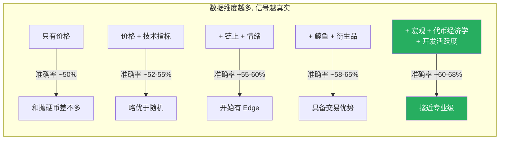

# 加密货币全量数据采集开源项目调研报告

> **调研日期**: 2026年3月16日  
> **核心关注**: 数据采集全面性 — 数据越多越全，分析越准确  
> **方法论**: 数据广度 × 数据深度 × 实时性 = 预测质量

---

## 核心观点

> [!IMPORTANT]
> 用户的直觉完全正确：**数据采集全面性是提升预测质量的第一瓶颈**。当前没有单一开源项目能覆盖所有数据维度，但通过组合多个专项工具可以构建接近商业级（Glassnode / Santiment / Nansen）的全量数据采集体系。本文按 **10 大数据维度** 逐一推荐最佳开源工具。

---

## 数据采集全景图

```mermaid
graph TB
    subgraph "💰 交易所数据"
        E1["CCXT<br/>100+交易所<br/>⭐35k+"]
        E2["Freqtrade 数据引擎<br/>⭐39.9k"]
    end

    subgraph "⛓️ 链上数据"
        O1["chaindl<br/>免费抓 Glassnode/<br/>Cryptoquant/Dune"]
        O2["pramaths/onchainanalysis<br/>多API自动切换"]
        O3["Web3-Indexer<br/>Solana链索引"]
    end

    subgraph "🐋 鲸鱼监控"
        W1["darkrenaissance/whallets<br/>鲸鱼钱包数据库"]
        W2["solana-whale-alert<br/>实时大额告警"]
        W3["crypto-whale-tracker<br/>USDC大额追踪"]
    end

    subgraph "📰 新闻与情绪"
        S1["crypto-sentiment MCP<br/>社交+新闻情绪"]
        S2["FinBERT<br/>金融NLP情绪"]
        S3["Reddit/Twitter<br/>爬虫分析"]
    end

    subgraph "📊 衍生品数据"
        D1["crypto-market-data<br/>免费衍生品数据集"]
        D2["CCXT Pro<br/>实时WebSocket"]
    end

    subgraph "🔬 综合分析平台"
        P1["OpenBB<br/>开源投研终端"]
        P2["OctoBot<br/>AI+社交指标"]
        P3["virattt/ai-hedge-fund<br/>多Agent分析"]
    end

    E1 & E2 --> P1 & P2 & P3
    O1 & O2 & O3 --> P1 & P3
    W1 & W2 & W3 --> P2 & P3
    S1 & S2 & S3 --> P2 & P3
    D1 & D2 --> P1 & P2
```



---

## 10 大数据维度 × 最佳开源工具

### 维度 1：交易所市场数据（OHLCV / OrderBook / Trades）

> 基础中的基础 — 价格、成交量、订单簿深度

| 项目 | Stars | 覆盖范围 | 特色 |
|------|-------|---------|------|
| **[ccxt/ccxt](https://github.com/ccxt/ccxt)** | **35,000+** | 100+ 交易所 | 统一 API，支持 Python/JS/PHP/C# |
| **[freqtrade](https://github.com/freqtrade/freqtrade)** | 39,900+ | 15+ 主流交易所 | 内置数据下载+历史数据管理 |

**CCXT 能获取的数据**：
- ✅ K线数据（所有时间周期）
- ✅ 实时订单簿深度
- ✅ 逐笔交易数据
- ✅ 资金费率（期货）
- ✅ 持仓量（期货）
- ✅ 交易对信息和市场信息

---

### 维度 2：链上数据（On-Chain Metrics）

> 看穿"链上真相" — 活跃地址、Gas、交易所流入流出

| 项目 | 数据源 | 关键能力 |
|------|--------|---------|
| **[dhruvan2006/chaindl](https://github.com/dhruvan2006/chaindl)** | Cryptoquant / Glassnode / Dune | **免费、无需 API Key**，直接返回 pandas DataFrame |
| **[pramaths/onchainanalysis](https://github.com/pramaths/onchainanalysis)** | 多 API | 自动 API 切换保证连续性，追踪交易+钱包+趋势 |
| **[fiv3fingers/Web3-Indexer](https://github.com/fiv3fingers/Web3-Indexer)** | Solana 链 | Go+PostgreSQL，生产级索引器，WebSocket 实时推送 |

**`chaindl` 能获取的指标示例**：
```python
import chaindl

# 从 Cryptoquant 获取交易所净流入
exchange_netflow = chaindl.get("cryptoquant", "exchange_netflow", "btc")

# 从 Glassnode 获取活跃地址数
active_addresses = chaindl.get("glassnode", "active_addresses", "eth")

# 从 Dune 获取自定义查询数据
dune_data = chaindl.get("dune", "query_id_12345")
```

> [!TIP]
> **`chaindl` 是本次调研的最大发现之一** — 它让你免费获取原本需要付费订阅 Glassnode/Cryptoquant 才能拿到的链上指标数据。

---

### 维度 3：鲸鱼（巨鲸）行为监控

> 追踪大户资金动向 — "Smart Money" 跟踪

| 项目 | 关键能力 |
|------|---------|
| **[darkrenaissance/whallets](https://github.com/darkrenaissance/whallets)** | 鲸鱼钱包地址数据库 + 链上移动追踪 + 跨链统一语法 |
| **[solana-whale-alert](https://github.com/solana-whale-alert)** | Solana 链实时鲸鱼检测 + Discord/Telegram 告警 |
| **[alexanderstahl93/crypto-whale-tracker](https://github.com/alexanderstahl93/crypto-whale-tracker)** | ETH 链 USDC 大额转账追踪 + Etherscan 链接 + 声音通知 |
| **Whale Alert API** | 付费 API，覆盖全链鲸鱼交易（可用 Python 封装调用） |

---

### 维度 4：社交媒体情绪分析

> 市场情绪先行于价格 — Reddit / Twitter / Telegram

| 项目 | 数据源 | 方法 |
|------|--------|------|
| **[crypto-sentiment MCP Server](https://github.com/)** | 社交媒体 + 新闻聚合 | MCP 协议，可被 AI Agent 直接调用 |
| **FinBERT / CryptoBERT** | 新闻文本 | 金融领域微调的 BERT 模型，专门理解金融/加密语境 |
| **Reddit API + PRAW** | r/CryptoCurrency 等 | 分析帖子情绪、讨论热度、关键词频率 |
| **Twitter/X API** | KOL 推文 | 追踪加密 KOL 发言、项目官方公告情绪 |

---

### 维度 5：新闻与事件数据

> 监管动态、项目公告、宏观事件

| 数据源 | 获取方式 | 覆盖内容 |
|--------|---------|---------|
| **CoinMarketCap / CoinGecko API** | 免费 API | 新闻聚合、代币事件日历 |
| **CryptoCompare API** | 免费额度 | 新闻 + 社交数据 + 历史数据 |
| **RSS Feeds 爬虫** | 自建爬虫 | CoinDesk / The Block / Decrypt 等主流媒体 |
| **GitHub Activity 监控** | GitHub API | 项目代码提交频率、Issue 活跃度、发布版本 |

---

### 维度 6：衍生品数据（期货 / 期权）

> 杠杆与多空博弈 — 资金费率、持仓量、爆仓

| 项目 | 数据内容 |
|------|---------|
| **[ErcinDedeoglu/crypto-market-data](https://github.com/ErcinDedeoglu/crypto-market-data)** | **免费**链上 + 衍生品数据集，CC BY 4.0 许可，为 ML 训练优化 |
| **CCXT Pro (WebSocket)** | 实时资金费率、持仓量、多空比 |
| **Coinglass API** | 免费额度获取爆仓、持仓、资金费率 |

---

### 维度 7：技术指标计算

> 基于原始数据计算的衍生特征

| 库/项目 | 语言 | 指标数量 |
|---------|------|---------|
| **TA-Lib** | Python/C | 150+ 技术指标（RSI/MACD/布林带等） |
| **pandas-ta** | Python | 130+ 指标，与 pandas 深度集成 |
| **ta (technical analysis)** | Python | 42 种指标，轻量级 |
| **Freqtrade 内置** | Python | 策略可直接调用所有 TA 指标 |

---

### 维度 8：宏观经济数据

> 利率、CPI、美元指数 — 影响加密市场的"外部变量"

| 数据源 | 获取方式 | 关键指标 |
|--------|---------|---------|
| **FRED API** | 免费 | 美联储利率、CPI、M2 货币供应 |
| **Yahoo Finance (yfinance)** | 免费 | DXY 美元指数、VIX 恐慌指数、黄金价格 |
| **Trading Economics API** | 有限免费 | 全球宏观指标 |

---

### 维度 9：代币经济学数据

> 供应量变化、解锁计划、销毁事件

| 数据源 | 内容 |
|--------|------|
| **CoinGecko API** | 市值、流通量、总供应量、FDV |
| **Token Unlocks API** | 代币解锁时间表、解锁金额 |
| **DefiLlama API** | TVL（锁仓量）、协议收入 |

---

### 维度 10：GitHub 开发活跃度

> 代码就是最诚实的基本面

| 方法 | 指标 |
|------|------|
| **GitHub API** | Commits/周、PR 活跃度、Issue 响应时间、Contributors 增长 |
| **Electric Capital Developer Report** | 行业级开发者趋势 |
| **Santiment Development Activity** | 代码活跃度评分（付费，但可用 chaindl 获取部分） |

---

## 推荐组合方案：构建完整数据采集系统

### 方案一：最小成本最大覆盖（推荐新手）

```
┌─────────────────────────────────────────────┐
│  CCXT (交易所数据)                            │
│  + chaindl (链上数据, 免费!)                  │
│  + crypto-market-data (衍生品数据集)           │
│  + PRAW (Reddit 情绪)                        │
│  + yfinance (宏观数据)                        │
│  + CoinGecko API (代币经济学)                  │
│  → 输入到 Freqtrade + FreqAI 进行分析预测     │
└─────────────────────────────────────────────┘
成本: $0  |  覆盖维度: 7/10  |  难度: ⭐⭐⭐
```

### 方案二：全量覆盖专业级

```
┌─────────────────────────────────────────────┐
│  CCXT (交易所全量)                            │
│  + chaindl (Glassnode/Cryptoquant/Dune)      │
│  + whallets (鲸鱼监控)                        │
│  + crypto-whale-tracker (大额追踪)            │
│  + FinBERT/CryptoBERT (新闻NLP情绪)          │
│  + Reddit + Twitter API (社交情绪)            │
│  + crypto-market-data (衍生品)                │
│  + DefiLlama + Token Unlocks (代币经济学)     │
│  + FRED + yfinance (宏观)                     │
│  + GitHub API (开发活跃度)                     │
│  → 存入 PostgreSQL / ClickHouse              │
│  → 输入到 ai-hedge-fund 多Agent分析           │
│  → 或 FreqAI 自适应学习                       │
└─────────────────────────────────────────────┘
成本: $0-50/月  |  覆盖维度: 10/10  |  难度: ⭐⭐⭐⭐⭐
```

### 方案三：AI Agent 自动化采集分析

```
┌─────────────────────────────────────────────┐
│  bnbchain-mcp (MCP 协议数据工具)              │
│  + crypto-sentiment MCP (情绪分析)            │
│  + OctoBot-AI (多Agent对冲基金框架)           │
│  → AI Agent 自主循环：                        │
│    采集 → 分析 → 判断 → 执行 → 反馈 → 再采集  │
└─────────────────────────────────────────────┐
成本: $0 + LLM API费用  |  覆盖维度: 8/10  |  难度: ⭐⭐⭐⭐
```

---

## 关键工具详细清单

| 工具/项目 | GitHub 链接 | 数据维度 | 推荐度 |
|-----------|------------|---------|--------|
| **CCXT** | [ccxt/ccxt](https://github.com/ccxt/ccxt) | 交易所 | ⭐⭐⭐⭐⭐ |
| **chaindl** | [dhruvan2006/chaindl](https://github.com/dhruvan2006/chaindl) | 链上 | ⭐⭐⭐⭐⭐ |
| **crypto-market-data** | [ErcinDedeoglu/crypto-market-data](https://github.com/ErcinDedeoglu/crypto-market-data) | 衍生品+链上 | ⭐⭐⭐⭐⭐ |
| **TA-Lib / pandas-ta** | 社区标准库 | 技术指标 | ⭐⭐⭐⭐⭐ |
| **whallets** | [darkrenaissance/whallets](https://github.com/darkrenaissance/whallets) | 鲸鱼监控 | ⭐⭐⭐⭐ |
| **onchainanalysis** | [pramaths/onchainanalysis](https://github.com/pramaths/onchainanalysis) | 链上分析 | ⭐⭐⭐⭐ |
| **FinBERT** | HuggingFace Model Hub | 新闻情绪 | ⭐⭐⭐⭐ |
| **Web3-Indexer** | [fiv3fingers/Web3-Indexer](https://github.com/fiv3fingers/Web3-Indexer) | Solana 链上 | ⭐⭐⭐⭐ |
| **whale-alert 工具** | 多个仓库 | 大额异动 | ⭐⭐⭐⭐ |
| **bnbchain-mcp** | [nirholas/bnbchain-mcp](https://github.com/nirholas/bnbchain-mcp) | BSC 全量 | ⭐⭐⭐⭐ |
| **yfinance** | PyPI 标准库 | 宏观经济 | ⭐⭐⭐⭐ |
| **DefiLlama API** | [DefiLlama](https://github.com/DefiLlama) | TVL/协议 | ⭐⭐⭐⭐ |
| **CoinGecko API** | 官方免费 API | 代币经济学 | ⭐⭐⭐⭐ |
| **awesome-crypto-api** | [CoinQuanta/awesome-crypto-api](https://github.com/CoinQuanta/awesome-crypto-api) | API 速查表 | ⭐⭐⭐ |
| **awesome-on-chain** | GitHub Curated List | 链上工具列表 | ⭐⭐⭐ |

---

## 数据全面性 vs 预测准确率的关系



> [!TIP]
> **关键洞察**：加密市场中 55%+ 的方向准确率配合合理的风险管理（止损/仓位管理），已足够盈利。不需要 90% 准确率，只需要 **数据比其他交易者更全面 + 持续学习适应**。

---

## 总结：数据是一切的基础

用户的判断非常准确。从搜索结果看：

| 关键发现 | 说明 |
|---------|------|
| **`chaindl` 是关键** | 免费获取原本需付费的 Glassnode/Cryptoquant 链上数据 |
| **`crypto-market-data` 是宝藏** | 免费衍生品+链上数据集，专为 ML 优化 |
| **CCXT 是地基** | 100+ 交易所统一 API，所有项目的底层依赖 |
| **鲸鱼监控是先行信号** | whallets + whale-tracker 追踪大户动向 |
| **情绪分析是差异化** | FinBERT + 社交爬虫是大多数人忽略的维度 |
| **没有单一项目能覆盖所有** | 必须组合多个工具构建完整采集体系 |

---

*调研完成于 2026年3月16日 17:37 CST*
