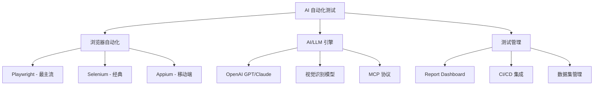

# AI 自动化测试平台 GitHub 项目分析报告

## 1. 研究概述

**搜索范围**: 使用 8 组关键词组合在 GitHub 全量搜索，总计发现约 50 个候选仓库

**搜索关键词**:
- `AI automated testing platform`
- `AI test automation framework`
- `AI testing platform LLM test`
- `AI powered test automation selenium`
- `intelligent test automation visual testing AI`
- `midscene browser AI testing`
- `self-healing test automation AI locator`
- `AI QA quality assurance automation agent`

**分析深度**: 对 Top 10 项目通过 MCP 远程读取 README、目录结构进行深度分析

---

## 2. Top 项目排名

| # | 仓库 | ⭐ Stars | 语言 | 相关性 | 质量 | 活跃度 | 综合分 | 子领域 |
|---|------|---------|------|--------|------|--------|--------|--------|
| 1 | magnitudedev/browser-agent | 4001 | TypeScript | 0.95 | 0.92 | 0.90 | **0.93** | 浏览器AI测试 |
| 2 | langwatch/langwatch | 3143 | TypeScript | 0.85 | 0.90 | 0.90 | **0.88** | LLM评估测试 |
| 3 | alumnium-hq/alumnium | 554 | Python | 0.95 | 0.75 | 0.90 | **0.87** | AI自动化测试 |
| 4 | guidewire-oss/fern-platform | 444 | Go | 0.80 | 0.73 | 0.70 | **0.75** | 测试智能分析 |
| 5 | MigoXLab/LMeterX | 182 | Python | 0.75 | 0.68 | 0.90 | **0.77** | AI性能测试 |
| 6 | Qeagle/reporter-engine | 101 | TypeScript | 0.70 | 0.65 | 0.40 | **0.60** | 测试报告分析 |
| 7 | Rahulec08/appium-mcp | 60 | TypeScript | 0.85 | 0.60 | 0.90 | **0.78** | 移动端AI测试 |
| 8 | proffesor-for-testing/sentinel-api-testing | 37 | Python | 0.90 | 0.55 | 0.90 | **0.78** | API AI测试 |
| 9 | SeldomQA/lounger | 24 | Python | 0.90 | 0.52 | 0.90 | **0.76** | 全栈AI测试 |
| 10 | brentkastner/ai-qa-framework | 16 | Python | 0.95 | 0.48 | 0.90 | **0.76** | 自主QA测试 |

---

## 3. 深度分析

### 3.1 magnitudedev/browser-agent ⭐4001

**概述**: 开源的 vision-first 浏览器代理，用于 AI 驱动的浏览器自动化测试
**Stars**: 4001 | **语言**: TypeScript | **最后活跃**: 2026-03-21

#### 架构
- 采用视觉优先(Vision-First)方案，通过 AI 视觉识别页面元素
- 底层集成 Playwright，上层提供 AI Agent 抽象
- 支持 RPA、Selenium 风格的测试编排
- Topics: `ai`, `automation`, `browser`, `framework`, `playwright`, `rpa`, `selenium`, `test`

#### 关键特性
- **视觉识别**: 无需 CSS/XPath 选择器，AI 直接"看"页面
- **自然语言驱动**: 用自然语言描述测试步骤
- **自愈能力**: 页面结构变化时自动适应
- **多浏览器支持**: 基于 Playwright 的跨浏览器兼容性

#### 可复用性
- 提取难度: **易** — npm 包形式，开箱即用
- 推荐组件: 浏览器控制引擎、视觉识别模块

#### 局限性
- 视觉识别依赖 AI 模型调用成本
- 大规模并行测试时性能需评估

---

### 3.2 langwatch/langwatch ⭐3143

**概述**: LLM 评估和 AI Agent 测试平台
**Stars**: 3143 | **语言**: TypeScript | **最后活跃**: 2026-03-21

#### 架构
- 全栈 TypeScript 应用(前端 + 后端)
- 支持多种 LLM Provider(OpenAI, Anthropic, DSPy 等)
- 提供 Datasets 管理、评估流水线、可观测性
- 低代码配置界面

#### 关键特性
- **LLM 评估基准**: 自动化评估 AI 模型输出质量
- **实时可观测性**: trace 追踪 + 性能分析
- **DSPy 集成**: 支持 prompt 工程优化
- **数据集管理**: 测试数据集版本化管理

#### 可复用性
- 提取难度: **中** — 完整平台部署，可 Docker 化
- 推荐组件: 评估引擎、trace 收集器

#### 局限性
- 定位偏向 LLM/AI Agent 测试，非传统 UI 自动化
- 部署复杂度较高

---

### 3.3 alumnium-hq/alumnium ⭐554

**概述**: AI 驱动的测试自动化框架，支持 Selenium/Playwright/Appium
**Stars**: 554 | **语言**: Python | **最后活跃**: 2026-03-20

#### 架构
- Python 库形式，可嵌入现有测试框架
- 支持 Selenium、Playwright、Appium 三大主流引擎
- 通过 LLM 实现自然语言到测试操作的转换

#### 关键特性
- **多引擎支持**: Selenium + Playwright + Appium 一套 API
- **AI 驱动**: 用自然语言描述测试步骤，AI 自动执行
- **自愈定位器**: 元素定位失败时自动尝试替代方案
- **Python + TypeScript 双语言支持**

#### 可复用性
- 提取难度: **易** — pip install 即用
- 推荐组件: AI 定位器、自愈模块、多引擎适配层

#### 局限性
- AI 调用增加测试执行时间
- 依赖 LLM API 的稳定性

---

### 3.4 guidewire-oss/fern-platform ⭐444

**概述**: 统一测试智能平台，多格式摄取 + 实时分析 + AI 洞察
**Stars**: 444 | **语言**: Go | **最后活跃**: 2026-03-12

#### 架构
- Go 后端 + 微服务架构
- 支持多种测试报告格式(JUnit XML, JSON, TAP 等)摄取
- LLM 集成用于智能分析
- 实时数据可视化 Dashboard

#### 关键特性
- **多格式报告摄取**: 统一处理各类测试框架输出
- **AI 智能分析**: 自动识别失败模式、趋势预测
- **实时 Dashboard**: 交互式测试数据可视化
- **企业级**: 多项目/多团队支持

#### 可复用性
- 提取难度: **中** — 独立服务部署
- 推荐组件: 报告解析引擎、AI 分析模块

#### 局限性
- 偏向"测试结果分析"而非"测试执行"
- Go 生态对非 Go 团队可能有学习成本

---

### 3.5 MigoXLab/LMeterX ⭐182

**概述**: 通用 API 压测平台，支持 LLM 推理和业务 HTTP 接口
**Stars**: 182 | **语言**: Python | **中文项目** | **最后活跃**: 2026-03-19

#### 架构
- Python + Locust 压测引擎
- 支持 LLM 推理接口和普通 HTTP 接口
- AI 智能分析与总结
- 一键压测 + 结果对比

#### 关键特性
- **LLM 推理压测**: 专门优化大模型推理场景
- **AI 分析总结**: 压测结果自动生成分析报告
- **一键测试**: 简化配置，快速开始
- **结果对比**: 多次测试结果横向对比

#### 可复用性
- 提取难度: **易** — Python pip 安装
- 推荐组件: LLM 压测模板、AI 报告生成器

#### 局限性
- 聚焦性能/压力测试，不覆盖功能测试
- 主要面向 API 层

---

### 3.6 Rahulec08/appium-mcp ⭐60

**概述**: AI 驱动的移动端自动化，通过 MCP 协议集成 Appium
**Stars**: 60 | **语言**: TypeScript | **最后活跃**: 2026-03-19

#### 架构
- MCP (Model Context Protocol) 服务器形式
- 连接 AI Agent(如 Claude)与 Appium 设备控制
- 智能视觉元素检测和恢复机制

#### 关键特性
- **MCP 集成**: 让 AI Agent 直接控制移动设备
- **视觉元素检测**: AI 驱动的智能定位
- **自动恢复**: 操作失败时智能重试/替代
- **Android + iOS**: 跨平台支持

#### 可复用性
- 提取难度: **易** — MCP 服务器独立运行
- 推荐组件: 设备控制层、视觉定位模块

#### 局限性
- 依赖 MCP 协议生态
- Stars 较少，社区规模小

---

### 3.7 proffesor-for-testing/sentinel-api-testing ⭐37

**概述**: AI Agentic API 测试平台，基于专用临时代理(Ephemeral Agent)
**Stars**: 37 | **语言**: Python | **最后活跃**: 2026-03-19

#### 架构
- 多代理架构(Multi-Agent)
- 每个测试任务创建临时专用 AI Agent
- Python FastAPI 后端

#### 关键特性
- **Agentic 测试**: AI Agent 自主设计和执行 API 测试
- **临时代理**: 每次测试创建独立 Agent，避免状态污染
- **智能用例生成**: 根据 API 文档自动生成测试用例
- **异常检测**: AI 驱动的异常响应分析

#### 可复用性
- 提取难度: **中** — 需理解 Agent 架构
- 推荐组件: Agent 编排引擎、测试用例生成器

#### 局限性
- 项目较年轻，文档和测试覆盖待完善
- Agent 调用成本较高

---

### 3.8 SeldomQA/lounger ⭐24

**概述**: 新一代自动化测试框架，支持 API 和 UI 测试，集成 AI 能力
**Stars**: 24 | **语言**: Python | **中文项目** | **最后活跃**: 2026-03-20

#### 架构
- Python 测试框架
- 同时支持 API 和 UI 自动化测试
- 集成 AI 能力（自然语言驱动、智能定位）

#### 关键特性
- **API + UI 双模式**: 一个框架覆盖接口和界面测试
- **AI 集成**: 自然语言描述测试步骤
- **中文友好**: 国产项目，中文文档完善
- **轻量级**: 快速上手

#### 可复用性
- 提取难度: **易** — pip install
- 推荐组件: AI 测试步骤解析器

#### 局限性
- Stars 较少，社区规模小
- 功能深度待验证

---

### 3.9 brentkastner/ai-qa-framework ⭐16

**概述**: 自主 AI 驱动的 QA 框架 — 给一个 URL，自动生成全面测试覆盖
**Stars**: 16 | **语言**: Python | **最后活跃**: 2026-03-20

#### 架构
- Python + Playwright + Anthropic Claude
- 给定 URL 后自动分析页面、生成测试用例、执行测试
- 全自主(0 人工干预)的 QA 流程

#### 关键特性
- **全自主测试**: 输入 URL → 自动生成 & 执行测试
- **Claude AI 驱动**: 利用大模型理解页面语义
- **Playwright 执行**: 稳定可靠的浏览器自动化
- **零配置**: 无需手写测试用例

#### 可复用性
- 提取难度: **易** — 独立脚本运行
- 推荐组件: 页面分析器、测试生成器

#### 局限性
- 非常早期项目
- 测试质量和覆盖度依赖 AI 理解准确性

---

### 3.10 Qeagle/reporter-engine ⭐101

**概述**: 现代化测试报告与分析平台，支持 AI 分析
**Stars**: 101 | **语言**: TypeScript (Node.js + React) | **最后活跃**: 2026-01

#### 架构
- Node.js + React + TypeScript 全栈
- REST API 集成，接收各类测试框架报告
- AI 驱动的测试结果分析
- 多项目支持 + 交互式 Dashboard

#### 关键特性
- **多项目管理**: 企业级多项目测试报告管理
- **AI 分析**: 自动分析失败原因和趋势
- **实时 Dashboard**: 交互式可视化
- **CI/CD 集成**: 无缝对接 CI 流水线

#### 可复用性
- 提取难度: **中** — 需部署前后端
- 推荐组件: 报告采集 API、分析引擎

#### 局限性
- 最近活跃度下降
- 偏向报告/分析，不涉及测试执行

---

## 4. 对比矩阵

| 维度 | browser-agent | langwatch | alumnium | fern-platform | LMeterX | appium-mcp | sentinel-api | lounger | ai-qa-framework | reporter-engine |
|------|:---:|:---:|:---:|:---:|:---:|:---:|:---:|:---:|:---:|:---:|
| **测试类型** | UI/E2E | LLM/Agent | UI/E2E/移动 | 报告分析 | 性能 | 移动端 | API | API+UI | UI/E2E | 报告分析 |
| **AI 能力** | ⭐⭐⭐ | ⭐⭐⭐ | ⭐⭐⭐ | ⭐⭐ | ⭐⭐ | ⭐⭐⭐ | ⭐⭐⭐ | ⭐⭐ | ⭐⭐⭐ | ⭐⭐ |
| **自愈能力** | ✅ | ❌ | ✅ | ❌ | ❌ | ✅ | ❌ | ❌ | ✅ | ❌ |
| **自然语言** | ✅ | ❌ | ✅ | ❌ | ❌ | ✅ | ✅ | ✅ | ✅ | ❌ |
| **视觉识别** | ✅ | ❌ | ❌ | ❌ | ❌ | ✅ | ❌ | ❌ | ❌ | ❌ |
| **多平台** | Web | - | Web+移动 | - | API | 移动 | API | Web+API | Web | - |
| **部署复杂度** | 低 | 高 | 低 | 中 | 低 | 低 | 中 | 低 | 低 | 中 |
| **中文支持** | ❌ | ❌ | ❌ | ❌ | ✅ | ❌ | ❌ | ✅ | ❌ | ❌ |
| **社区规模** | 大 | 大 | 中 | 中 | 小 | 小 | 小 | 小 | 小 | 小 |
| **许可证** | 开源 | 开源 | 开源 | 开源 | 开源 | 开源 | 开源 | 开源 | 开源 | 开源 |

---

## 5. 技术趋势

### 常用技术栈

### 核心架构模式

| 模式 | 描述 | 代表项目 |
|------|------|----------|
| **Vision-First** | 通过 AI 视觉识别页面元素，替代传统选择器 | browser-agent |
| **Natural Language Driven** | 自然语言描述测试步骤，AI 翻译为操作 | alumnium, lounger |
| **Self-Healing** | 定位器失效时 AI 自动寻找替代方案 | alumnium, browser-agent |
| **Agentic Testing** | AI Agent 自主设计和执行测试 | sentinel-api, ai-qa-framework |
| **MCP Integration** | 通过 MCP 协议让 AI Agent 控制设备/浏览器 | appium-mcp |
| **Test Intelligence** | AI 分析测试结果，发现趋势和根因 | fern-platform, langwatch |

### 发展方向
1. **从"辅助"到"自主"**: AI 从辅助定位元素 → 自主设计和执行完整测试
2. **MCP 生态**: Model Context Protocol 成为 AI Agent 与测试工具集成的标准
3. **多模态融合**: 视觉 + 语义 + DOM 结构同时用于理解页面
4. **LLM 评估测试化**: LLM/Agent 评估正在成为一个独立测试领域

---

## 6. 推荐方案

### 🏆 最佳学习项目
| 项目 | 理由 |
|------|------|
| [alumnium](https://github.com/alumnium-hq/alumnium) | API 简洁清晰、多引擎支持、适合理解 AI 测试核心概念 |
| [ai-qa-framework](https://github.com/brentkastner/ai-qa-framework) | 代码精简、完整展示"给URL自动生成测试"流程 |

### 🚀 最佳生产级项目
| 项目 | 理由 |
|------|------|
| [browser-agent](https://github.com/magnitudedev/browser-agent) | Stars 最多、社区活跃、Vision-First 方案成熟 |
| [langwatch](https://github.com/langwatch/langwatch) | LLM 测试评估领域最完善的开源方案 |
| [fern-platform](https://github.com/guidewire-oss/fern-platform) | 企业级测试智能平台，Guidewire 开源出品 |

### 💡 最佳创新项目
| 项目 | 理由 |
|------|------|
| [sentinel-api-testing](https://github.com/proffesor-for-testing/sentinel-api-testing) | Agentic 多代理 API 测试，代表未来方向 |
| [appium-mcp](https://github.com/Rahulec08/appium-mcp) | MCP + 移动端自动化的创新结合 |

### 🇨🇳 中文友好项目
| 项目 | 理由 |
|------|------|
| [LMeterX](https://github.com/MigoXLab/LMeterX) | 国产 AI 压测平台，中文文档完善 |
| [lounger](https://github.com/SeldomQA/lounger) | 国产新一代测试框架，中文生态 |

---

## 7. 总结

AI 自动化测试平台已形成清晰的技术分层：

1. **测试执行层**: browser-agent、alumnium 代表了 AI 驱动的新一代测试执行引擎，核心创新在于**视觉识别**和**自然语言驱动**
2. **测试智能层**: langwatch、fern-platform 专注于测试结果的 AI 分析，让测试数据产生更大价值
3. **垂直领域**: appium-mcp(移动端)、sentinel-api(API)、LMeterX(性能) 各自在细分领域深耕
4. **Agentic 趋势**: 从"AI 辅助测试"向"AI 自主测试"演进是最明确的趋势，ai-qa-framework 和 sentinel-api 是典型代表

> **建议关注**: browser-agent(最成熟)和 alumnium(最实用)作为核心参考，同时关注 MCP 协议生态的发展对测试自动化的推动作用。
