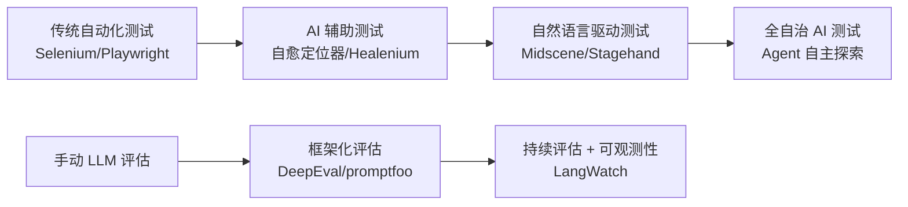
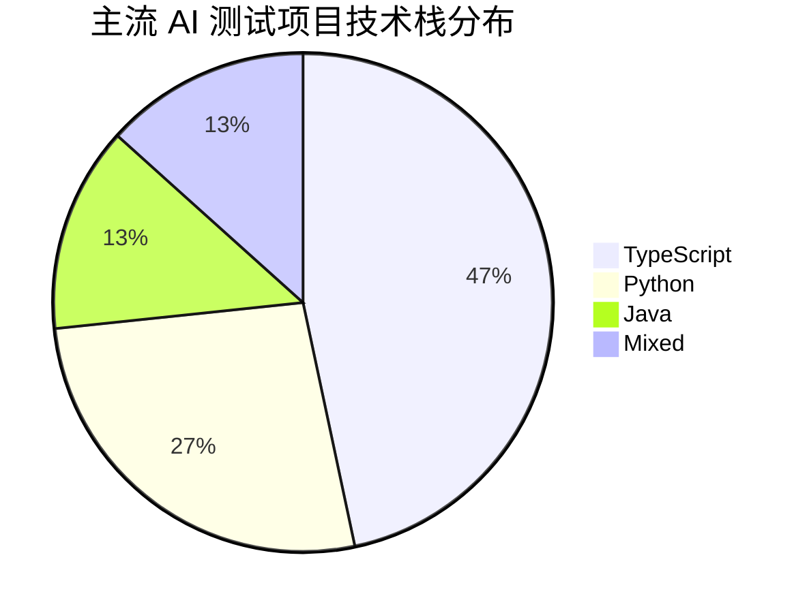

# AI 自动化测试平台 GitHub 项目扩展分析报告

> 基于 20+ 组关键词搜索、深度分析 15+ 个核心仓库生成

## 1. 全景项目矩阵

### 1.1 按 Stars 排序的 Top 项目汇总

| 排名 | 项目 | Stars | Fork | 语言 | 子领域 | 核心技术 |
|:---:|------|------:|-----:|------|--------|----------|
| 1 | [browserbase/stagehand](https://github.com/browserbase/stagehand) | **21,650** | 1,427 | TypeScript | AI 浏览器自动化 | Playwright + LLM |
| 2 | [promptfoo/promptfoo](https://github.com/promptfoo/promptfoo) | **18,023** | 1,544 | TypeScript | LLM 评估/红队 | 多模型评估 + CI/CD |
| 3 | [confident-ai/deepeval](https://github.com/confident-ai/deepeval) | **14,210** | 1,299 | Python | LLM 评估框架 | 14+ 评估指标 |
| 4 | [web-infra-dev/midscene](https://github.com/web-infra-dev/midscene) | **12,272** | 907 | TypeScript | Vision-First UI 自动化 | 多模态 AI + Playwright |
| 5 | [metersphere/metersphere](https://github.com/metersphere/metersphere) | **11,000+** | - | Java/Vue | 综合测试管理平台 | Spring Boot + Vue |
| 6 | [magnitudedev/browser-agent](https://github.com/magnitudedev/browser-agent) | **4,001** | - | TypeScript | AI E2E 测试 | Vision AI + 浏览器 |
| 7 | [langwatch/langwatch](https://github.com/langwatch/langwatch) | **3,143** | - | TypeScript | LLM 可观测性 | OpenTelemetry + 评估 |
| 8 | [alumnium-hq/alumnium](https://github.com/alumnium-hq/alumnium) | **554** | - | Python | AI Selenium 增强 | LLM + Selenium |
| 9 | [testdevhome/Autotestplat](https://github.com/testdevhome/Autotestplat) | **460** | 235 | Python | AI+自动化测试平台 | Django + Celery + Selenium |
| 10 | [guidewire-oss/fern-platform](https://github.com/guidewire-oss/fern-platform) | **444** | - | TypeScript | AI 测试报告分析 | LLM + JUnit/Allure |
| 11 | [healenium/healenium-web](https://github.com/healenium/healenium-web) | **198** | 45 | Java | 自愈 Selenium | ML 定位器修复 |
| 12 | [MigoXLab/LMeterX](https://github.com/MigoXLab/LMeterX) | **182** | - | Python | AI 性能测试 | LLM + k6/Locust |

---

## 2. 项目分类深度分析

### 2.1 🌐 AI 浏览器自动化 (Vision-First)

#### Stagehand (browserbase/stagehand) — ⭐ 21,650

```
定位: The AI Browser Automation Framework
```

| 维度 | 详情 |
|------|------|
| **核心能力** | `act()` 执行操作、`extract()` 提取数据、`observe()` 观察页面 |
| **技术架构** | TypeScript monorepo, 基于 Playwright, pnpm workspace |
| **LLM 支持** | OpenAI, Anthropic, Google 等多模型 |
| **特色** | 自然语言指令驱动、AI Agent 原语、无需选择器 |
| **适用场景** | Web Agent 构建、数据提取、自动化工作流 |
| **许可证** | MIT |

**关键优势**:
- 行业最高星标的 AI 浏览器自动化框架
- 简洁的 3 API 设计(`act`, `extract`, `observe`)
- 活跃的社区和生态系统

---

#### Midscene.js (web-infra-dev/midscene) — ⭐ 12,272

```
定位: AI-powered, vision-driven UI automation for every platform
```

| 维度 | 详情 |
|------|------|
| **核心能力** | Vision-First UI 理解、自然语言操作、数据提取与断言 |
| **技术架构** | TypeScript monorepo, pnpm workspace + nx 构建 |
| **集成方案** | Playwright, Puppeteer, Appium, Chrome Extension |
| **运行方式** | 本地运行 + 多模型支持(GPT-4o, Claude, Gemini, 国产模型) |
| **特色** | 可视化调试报告、YAML 用例格式、操作缓存加速 |
| **许可证** | MIT |
| **背景** | 字节跳动 Web Infra 团队出品 |

**关键优势**:
- 中国团队开发，文档中英双语
- 支持 Web + 移动端(Appium)，跨平台覆盖
- 可视化调试报告是独特亮点
- 支持缓存机制降低 LLM 调用成本

**与 Stagehand 对比**:
```
Stagehand: Agent 构建导向，3 API 极简设计
Midscene:  测试自动化导向，Vision + 操作缓存，跨平台
```

---

#### Magnitude (magnitudedev/browser-agent) — ⭐ 4,001

```
定位: Open source AI-powered end-to-end testing framework
```

| 维度 | 详情 |
|------|------|
| **核心能力** | 自然语言写测试 → AI 执行 → 自动断言 |
| **技术方案** | Vision AI 分析页面，计划 + 执行循环 |
| **特色** | 无需选择器、自愈测试、AI 自动断言 |
| **适用场景** | E2E 回归测试、冒烟测试 |

---

#### Alumnium (alumnium-hq/alumnium) — ⭐ 554

```
定位: LLM-powered Selenium enhancement
```

| 维度 | 详情 |
|------|------|
| **核心能力** | 将自然语言指令翻译为 Selenium 操作 |
| **技术方案** | Python + Selenium + LLM |
| **特色** | 无缝集成现有 Selenium 项目 |

---

### 2.2 🧪 LLM 评估与测试

#### promptfoo (promptfoo/promptfoo) — ⭐ 18,023

```
定位: Test your prompts, agents, and RAGs. Red teaming for AI.
```

| 维度 | 详情 |
|------|------|
| **核心能力** | Prompt 测试、模型对比、红队安全测试、漏洞扫描 |
| **技术架构** | TypeScript, CLI + Web UI |
| **集成** | CI/CD 集成、声明式 YAML 配置 |
| **支持模型** | GPT, Claude, Gemini, Llama 等 |
| **特色** | 安全评估、性能基准、自定义断言 |
| **许可证** | MIT |

**适用场景**:
- AI 应用上线前的 Prompt 回归测试
- LLM 模型性能对比与选型
- AI 安全红队评估

---

#### DeepEval (confident-ai/deepeval) — ⭐ 14,210

```
定位: The LLM Evaluation Framework
```

| 维度 | 详情 |
|------|------|
| **核心能力** | 14+ 评估指标（忠实度、幻觉检测、相关性等） |
| **技术架构** | Python, pytest 风格 API |
| **特色** | RAG 评估、红队攻击测试、基准数据集 |
| **许可证** | Apache-2.0 |

**适用场景**:
- RAG 应用质量评估
- LLM 输出的忠实度/幻觉检测
- AI 应用的回归测试

---

#### LangWatch (langwatch/langwatch) — ⭐ 3,143

```
定位: LLM 可观测性与评估一体化平台
```

| 维度 | 详情 |
|------|------|
| **核心能力** | 追踪、评估、可观测性 |
| **技术架构** | TypeScript + OpenTelemetry |
| **特色** | 实时监控 + 自动化评估 |

---

### 2.3 🔧 自愈测试 (Self-Healing)

#### Healenium (healenium/healenium-web) — ⭐ 198

```
定位: Self-healing library for Selenium Web-based tests
```

| 维度 | 详情 |
|------|------|
| **核心能力** | 自动修复失效的 Selenium 定位器 |
| **技术架构** | Java, Selenium WebDriver 扩展 |
| **原理** | ML 算法分析 DOM 变化，自动更新选择器 |
| **特色** | 即插即用、最小侵入、降低维护成本 |
| **许可证** | Apache-2.0 |

**适用场景**:
- 维护大量 Selenium 测试脚本的团队
- 前端频繁更新导致定位器失效

---

### 2.4 📊 综合测试管理平台

#### MeterSphere (metersphere/metersphere) — ⭐ 11,000+

```
定位: 一站式开源持续测试平台
```

| 维度 | 详情 |
|------|------|
| **核心能力** | 测试跟踪、接口测试、UI 测试、性能测试 |
| **技术架构** | Java(Spring Boot) + Vue.js + Docker |
| **特色** | 全流程覆盖、团队协作、数据驱动 |
| **背景** | FIT2CLOUD 飞致云出品 |
| **许可证** | GPL-3.0 |

---

#### Autotestplat (testdevhome/Autotestplat) — ⭐ 460

```
定位: AI+自动化测试平台系统 (小麦实验室出品)
```

| 维度 | 详情 |
|------|------|
| **核心能力** | API 测试 + Web UI 测试 + 大模型接入 |
| **技术架构** | Django + Celery + Selenium + Redis |
| **特色** | 已接入大模型能力(v6.0)、B站教程配套 |
| **许可证** | Apache-2.0 |

---

### 2.5 🔍 其他垂直领域项目

| 项目 | Stars | 子领域 | 描述 |
|------|------:|--------|------|
| [fern-platform](https://github.com/guidewire-oss/fern-platform) | 444 | AI 测试报告分析 | 用 LLM 分析 JUnit/Allure 报告，自动定位失败原因 |
| [LMeterX](https://github.com/MigoXLab/LMeterX) | 182 | AI 性能测试 | LLM 生成性能测试脚本(k6/Locust) |
| [Playwright-AI-Agent-POM](https://github.com/padmarajnidagundi/Playwright-AI-Agent-POM-MCP-Server) | 22 | AI Playwright | MCP Server + POM 架构 |
| [GreenLight](https://github.com/eidra-umain/GreenLight) | 1 | 自然语言 E2E | 纯英语用户故事驱动 E2E 测试 |

---

## 3. 技术趋势洞察

### 3.1 技术演进路线图



### 3.2 五大核心趋势

| # | 趋势 | 代表项目 | 成熟度 |
|:---:|------|---------|:------:|
| 1 | **Vision-First**: 用视觉 AI 理解 UI，替代选择器 | Midscene, Stagehand | 🟢 成熟 |
| 2 | **自然语言测试**: 用自然语言描述测试步骤 | Magnitude, GreenLight | 🟡 成长 |
| 3 | **LLM 评估标准化**: AI 输出质量自动化评估 | DeepEval, promptfoo | 🟢 成熟 |
| 4 | **自愈测试**: ML 自动修复失效选择器 | Healenium | 🟡 成长 |
| 5 | **全栈 AI 测试管理**: AI 融入传统测试管理平台 | MeterSphere, Autotestplat | 🟡 成长 |

### 3.3 技术栈偏好



---

## 4. 场景化推荐矩阵

### 4.1 按使用场景推荐

| 场景 | 首选 | 备选 | 说明 |
|------|------|------|------|
| **Web E2E 自动化** | Midscene.js | Stagehand, Magnitude | Midscene 有中文支持和可视化调试 |
| **Web Agent 构建** | Stagehand | Midscene.js | Stagehand API 更简洁，Agent 导向 |
| **LLM/RAG 评估** | DeepEval | promptfoo | DeepEval 指标更丰富，pytest 集成 |
| **Prompt 安全测试** | promptfoo | - | 红队/渗透测试领域唯一选择 |
| **Selenium 增强** | Healenium | Alumnium | Healenium 自愈，Alumnium NL 驱动 |
| **综合测试管理** | MeterSphere | Autotestplat | MeterSphere 功能完整，Autotestplat 有 AI |
| **测试报告分析** | Fern Platform | - | 用 LLM 分析测试失败原因 |
| **移动端 AI 测试** | Midscene.js | - | 支持 Appium 集成 |

### 4.2 按团队规模推荐

| 团队规模 | 推荐方案 |
|----------|----------|
| **个人/小团队** | Midscene.js + DeepEval |
| **中型团队** | Stagehand + promptfoo + MeterSphere |
| **大型企业** | MeterSphere + Healenium + promptfoo |

---

## 5. 与上一份报告的增量发现

相比第一份报告，本轮新增以下关键发现：

| 项目 | Stars | 新发现亮点 |
|------|------:|------------|
| **Stagehand** | 21,650 | 行业最高星标 AI 浏览器自动化框架 |
| **promptfoo** | 18,023 | LLM 安全红队评估领域标杆 |
| **DeepEval** | 14,210 | Python 生态 LLM 评估标准框架 |
| **Midscene.js** | 12,272 | 字节跳动出品，中文生态最佳 |
| **Healenium** | 198 | Java 生态自愈测试唯一成熟方案 |
| **GreenLight** | 1 | 最新（2026.03）自然语言 E2E 创新项目 |

---

## 6. 总结

AI 自动化测试领域已形成 **三大核心赛道**：

1. **AI 浏览器自动化** — Stagehand(21.6k⭐) > Midscene(12.3k⭐) > Magnitude(4k⭐)
2. **LLM 评估测试** — promptfoo(18k⭐) > DeepEval(14.2k⭐) > LangWatch(3.1k⭐)
3. **综合测试管理** — MeterSphere(11k+⭐) > Autotestplat(460⭐)

**最值得关注**: Midscene.js（中文生态最佳 + 跨平台）和 promptfoo（LLM 安全测试标杆）是当前最具实用价值的两个项目。
