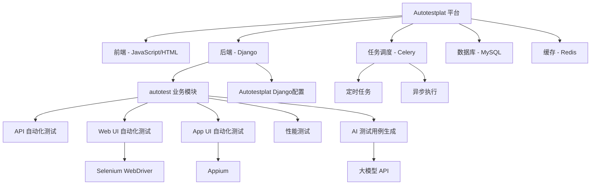
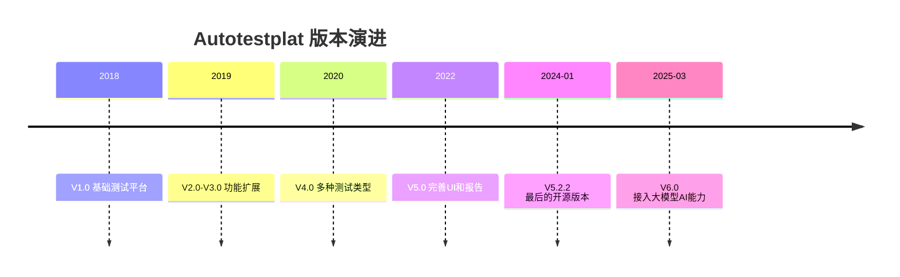

# 小麦实验室 Autotestplat 深度分析报告

## 项目概览

| 属性 | 值 |
|------|-----|
| **仓库地址** | [testdevhome/Autotestplat](https://github.com/testdevhome/Autotestplat) |
| **描述** | AI+自动化测试平台系统 |
| **Stars** | 460 ⭐ |
| **Forks** | 235 |
| **语言** | JavaScript (前端) + Python (后端) |
| **许可证** | GPL-3.0 |
| **创建时间** | 2018-05-16 |
| **最后更新** | 2025-03-27 |
| **开源版本** | v5.2.2 及以前免费开源 |
| **最新版本** | v6.0（接入大模型，支持 AI 生成测试用例） |

---

## 技术架构



### 目录结构

```
testdevhome/Autotestplat/
├── Autotestplat/                 # Django 项目配置
│   ├── __init__.py               # Celery 初始化
│   ├── celery.py                 # Celery 任务调度配置
│   ├── settings.py               # Django 设置
│   ├── urls.py                   # URL 路由
│   └── wsgi.py                   # WSGI 入口
├── autotest/                     # 核心业务模块
│   ├── models/                   # 数据模型
│   ├── views/                    # 视图逻辑
│   ├── templates/                # 页面模板
│   ├── static/                   # 静态资源
│   └── ...
├── Redis-x64-3.2.100/            # Redis Windows 版本
├── autotestplat.sql              # 数据库初始化脚本
├── chromedriver.exe              # Chrome 驱动
├── manage.py                     # Django 管理脚本
├── requirements.txt              # Python 依赖
├── start_service.bat             # 启动服务脚本
├── start_worker.bat              # 启动 Celery Worker
├── start_beat.bat                # 启动 Celery Beat（定时任务）
└── Autotestplat-V5.0使用手册.docx  # 使用手册
```

### 核心依赖（requirements.txt）

| 类别 | 依赖库 | 用途 |
|------|--------|------|
| **Web 框架** | Django | 后端框架 |
| **任务调度** | Celery + django-celery-beat + django-celery-results | 异步任务 & 定时任务 |
| **消息队列** | Redis | Celery Broker |
| **自动化测试** | Selenium | Web UI 自动化 |
| **HTTP 请求** | requests | API 接口测试 |
| **数据库** | mysqlclient / PyMySQL | MySQL 连接 |
| **报告** | HTMLTestRunner | 测试报告生成 |

---

## 功能模块

### 核心功能

| 模块 | 功能描述 | 技术实现 |
|------|----------|----------|
| **产品/项目管理** | 多产品、多项目的组织管理 | Django Models |
| **用户管理** | 用户权限、角色管理 | Django Auth |
| **API 自动化测试** | HTTP 接口自动化测试、参数化 | requests 库 |
| **Web UI 自动化测试** | 浏览器端 UI 自动化测试 | Selenium + ChromeDriver |
| **App UI 自动化测试** | 移动端 UI 自动化测试 | Appium |
| **性能测试** | 实时接口性能测试 | 自定义实现 |
| **测试用例管理** | 用例创建、编辑、关联 | Django Admin |
| **测试计划** | 测试计划制定与执行 | Celery Task |
| **定时任务** | 自动化定时执行测试 | Celery Beat |
| **测试报告** | 自动生成测试报告 | HTMLTestRunner |
| **AI 测试用例生成** (V6.0) | 大模型驱动的智能测试用例生成 | LLM API |

### 版本演进



---

## 亮点分析

### ✅ 优势

1. **全栈测试覆盖**: API + Web UI + App UI + 性能测试，一个平台覆盖所有主流测试类型
2. **中文生态**: 完整中文文档和使用手册，对国内团队极为友好
3. **成熟稳定**: 从 2018 年开发至今，经历多个版本迭代，项目成熟
4. **开箱即用**: 提供 Windows 启动脚本、数据库初始化 SQL、ChromeDriver，降低部署门槛
5. **任务调度**: Celery + Beat 实现异步执行和定时任务，支持自动化回归测试
6. **AI 能力** (V6.0): 接入大模型，支持 AI 生成测试用例，跟上行业趋势
7. **较大社区**: 460 Stars + 235 Forks，在国产测试平台中属于头部

### ⚠️ 局限性

1. **开源限制**: V6.0（含 AI 功能）不再开源，开源版本停留在 V5.2.2
2. **技术栈偏老**: Django + jQuery 前端，未使用现代前端框架（Vue/React）
3. **Windows 强绑定**: 提供 `.bat` 启动脚本和 Windows Redis，跨平台支持不足
4. **代码规范**: 仓库包含二进制文件（chromedriver.exe、Redis），不符合现代 Git 最佳实践
5. **测试覆盖**: 未见完善的单元测试目录
6. **文档**: 使用手册为 `.docx` 格式，非 Markdown/在线文档

---

## 与其他 AI 测试平台对比

| 维度 | Autotestplat | browser-agent | alumnium | Midscene |
|------|:---:|:---:|:---:|:---:|
| **定位** | 全栈测试管理平台 | 浏览器 AI 测试 | AI 测试自动化库 | AI 页面交互框架 |
| **AI 能力** | V6.0 AI 用例生成 | 视觉识别+自愈 | 自然语言+自愈 | 自然语言+视觉 |
| **测试管理** | ✅ 完整 | ❌ 无 | ❌ 无 | ❌ 无 |
| **多类型测试** | API+UI+App+性能 | 仅 Web UI | Web+App | Web UI |
| **中文支持** | ✅ 原生 | ❌ | ❌ | ✅ |
| **开源程度** | 部分开源 | 完全开源 | 完全开源 | 完全开源 |
| **技术栈** | Django+Celery | TypeScript+Playwright | Python+多引擎 | TypeScript+Playwright |
| **Stars** | 460 | 4001 | 554 | ~5000+ |

> **核心差异**: Autotestplat 是一个**完整的测试管理平台**（含项目管理、用例管理、计划执行、报告），而其他项目更多是**测试执行引擎/库**。两者定位不同，互为补充。

---

## 适用场景

1. **中小团队快速搭建测试平台**: 需要一站式管理 API/UI/App/性能测试的团队
2. **学习测试平台架构**: 理解如何用 Django + Celery 构建自动化测试平台
3. **简历项目参考**: 展示全栈测试平台开发能力（前后端 + 任务调度 + 自动化测试）
4. **二次开发基础**: 在 V5.2.2 开源版本基础上扩展定制功能

---

## 总结

小麦实验室的 Autotestplat 是国内较为成熟的**全栈自动化测试管理平台**，核心价值在于：
- **全类型覆盖**: API/Web UI/App UI/性能测试一站式管理
- **中文友好**: 原生中文支持，降低国内团队使用门槛
- **AI 演进**: V6.0 接入大模型，顺应 AI+测试趋势

但需注意 AI 能力（V6.0）已不再开源，开源版本（V5.2.2）仅提供传统自动化测试能力。如需完全开源的 AI 测试方案，建议参考 `browser-agent` 或 `alumnium`。
