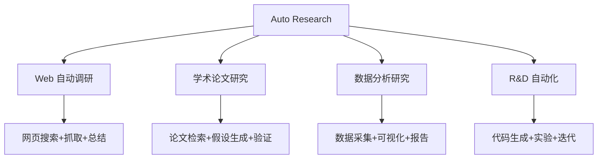
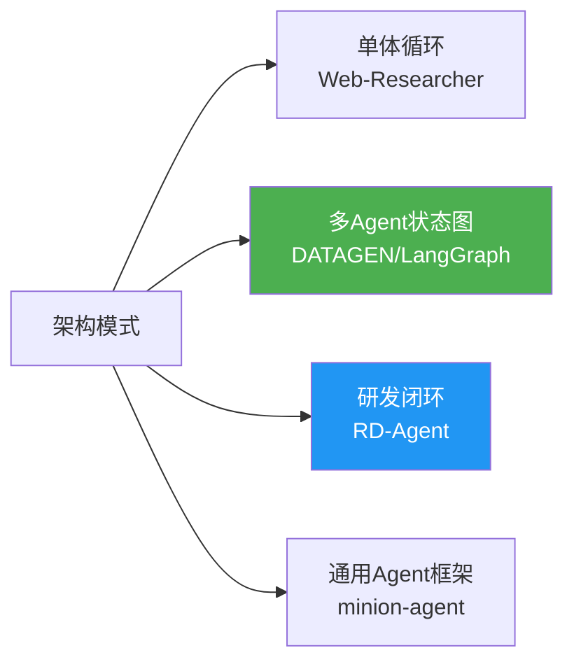

# Auto Research 项目 GitHub 分析报告

> 基于 `github-research` skill (MCP 版) 4 阶段流水线生成  
> 搜索时间：2026-03-17 | 搜索范围：76 个候选仓库，筛选 Top 10 深度分析

---

## 1. 研究概述

### 搜索策略

| # | 搜索关键词 | 结果数 |
|---|-----------|--------|
| 1 | `auto deep research agent` | 61 |
| 2 | `automated AI researcher LLM` | 224 |
| 3 | `deep research open source multi-agent` | 15 |
| 4 | `AI research assistant autonomous agent LangGraph` | 6 |
| 5 | `automated web research LLM scraping` | 10+ |

**去重后候选仓库**：76 个（过滤 archived/fork 后）

### 领域定义

"Auto Research" 涵盖以下核心场景：



---

## 2. Top 10 项目排名

### 评分公式

```
composite = relevance × 0.4 + quality × 0.35 + activity × 0.25
```

| # | 项目 | ⭐ Stars | 语言 | 相关性 | 质量 | 活跃度 | 综合分 | 类型 |
|---|------|---------|------|--------|------|--------|--------|------|
| 1 | [microsoft/RD-Agent](https://github.com/microsoft/RD-Agent) | 11,853 | Python | 0.85 | 0.98 | 1.00 | 0.93 | R&D 自动化 |
| 2 | [TheBlewish/Automated-AI-Web-Researcher-Ollama](https://github.com/TheBlewish/Automated-AI-Web-Researcher-Ollama) | 2,959 | Python | 0.95 | 0.85 | 0.90 | 0.91 | Web 调研 |
| 3 | [starpig1129/DATAGEN](https://github.com/starpig1129/DATAGEN) | 1,648 | Python | 0.90 | 0.82 | 0.90 | 0.88 | 数据分析研究 |
| 4 | [HKUDS/Auto-Deep-Research](https://github.com/HKUDS/Auto-Deep-Research) | 1,431 | Python | 0.95 | 0.80 | 0.40 | 0.76 | 深度调研 |
| 5 | [femto/minion-agent](https://github.com/femto/minion-agent) | 387 | Python | 0.85 | 0.68 | 0.90 | 0.81 | Agent 框架 |
| 6 | [SPThole/CoexistAI](https://github.com/SPThole/CoexistAI) | 453 | Jupyter | 0.80 | 0.70 | 0.90 | 0.80 | 研究助手框架 |
| 7 | [NoviScl/Automated-AI-Researcher](https://github.com/NoviScl/Automated-AI-Researcher) | 68 | Python | 0.95 | 0.55 | 0.70 | 0.76 | 学术 AI 研究 |
| 8 | [whotto/AI_Automated_Research_Workflow](https://github.com/whotto/AI_Automated_Research_Workflow) | 33 | Python | 0.90 | 0.50 | 0.40 | 0.64 | 市场调研 |
| 9 | [ai8hyf/OpenResearchAssistant](https://github.com/ai8hyf/OpenResearchAssistant) | 137 | HTML | 0.85 | 0.60 | 0.30 | 0.62 | 论文洞察 |
| 10 | [agruai/company-research-agent](https://github.com/agruai/company-research-agent) | 107 | Python | 0.80 | 0.58 | 0.70 | 0.70 | 企业调研 |

> **评分说明**：相关性由 Agent 根据项目描述和 README 内容判断；质量基于 `log(stars) + forks + license + docs` 归一化；活跃度基于最后推送日期距今天数。

---

## 3. 深度分析

### 3.1 microsoft/RD-Agent ⭐ 11,853

**定位**：微软研究院出品的 R&D 自动化框架，专注金融量化领域的研究与开发自动化。

| 维度 | 详情 |
|------|------|
| **核心功能** | 自动化假设生成 → 代码实现 → 实验验证 → 迭代优化的闭环 |
| **架构** | 基于 LLM 的 Proposal → Experiment → Evaluation 循环 |
| **技术栈** | Python, OpenAI API, Qlib (金融), Docker |
| **许可证** | MIT |
| **活跃度** | 极高 — 每天有提交，团队持续维护 |
| **文档** | 优秀 — ReadTheDocs 文档站 + Tech Report + 论文 |

**架构特点**：
- **研发闭环**：Scenario → Hypothesis → Experiment → Feedback → Iterate
- **多场景支持**：量化因子研究、模型训练、数据挖掘
- **Knowledge Graph**：内建知识图谱管理研发知识
- 有在线 Demo（Azure 部署）

**优势**：微软背书 + 生产级代码质量 + 完善文档  
**局限**：强绑定金融量化场景，通用研究场景需要较大改造

---

### 3.2 TheBlewish/Automated-AI-Web-Researcher-Ollama ⭐ 2,959

**定位**：基于 Ollama 本地 LLM 的全自动 Web 调研工具，单一查询即可自动进行结构化网络研究。

| 维度 | 详情 |
|------|------|
| **核心功能** | 自动分解查询 → 生成搜索焦点 → Web 搜索 → 抓取网页 → 总结研究 |
| **架构** | 单体 Python 应用，核心文件：`research_manager.py`(59K), `Web-LLM.py`, `Self_Improving_Search.py` |
| **技术栈** | Python, Ollama, DuckDuckGo Search API, BeautifulSoup |
| **许可证** | MIT |
| **活跃度** | 高 — 持续有更新 |
| **文档** | 良好 — README 有视频演示 |

**工作流程**：
1. 用户输入研究查询
2. LLM 生成 5 个优先级排序的研究焦点
3. 每个焦点自动搜索 → 选择最相关网页 → 抓取内容
4. 研究完成后 LLM 生成综合摘要
5. 进入对话模式，可追问

**代码结构**：
```
├── Web-LLM.py                  # 入口文件 (11K)
├── research_manager.py          # 核心研究管理器 (59K)
├── Self_Improving_Search.py     # 自改进搜索引擎 (21K)
├── llm_wrapper.py               # LLM 封装 (6.6K)
├── llm_response_parser.py       # 响应解析 (9.4K)
├── strategic_analysis_parser.py # 战略分析解析 (8.1K)
├── web_scraper.py               # 网页抓取 (5.6K)
└── llm_config.py                # 配置 (2K)
```

**优势**：完全本地运行（Ollama）、零 API 费用、自改进搜索  
**局限**：单体架构（`research_manager.py` 达 59K），扩展性一般；依赖 Ollama 模型质量

---

### 3.3 starpig1129/DATAGEN ⭐ 1,648

**定位**：AI 驱动的多 Agent 数据分析和研究平台，自动完成假设生成 → 数据分析 → 可视化 → 报告。

| 维度 | 详情 |
|------|------|
| **核心功能** | 假设生成、数据分析代码编写、可视化、文献搜索、报告撰写、质量审查 |
| **架构** | LangGraph 状态图管理的多 Agent 系统 |
| **技术栈** | Python, LangChain, LangGraph, OpenAI GPT, Gradio |
| **许可证** | MIT |
| **活跃度** | 高 — 2026-03 仍有更新 |
| **文档** | 良好 — 有架构图和详细 README |

**Agent 体系**：
```
hypothesis_agent  → 生成研究假设
process_agent     → 监督整体流程
visualization_agent → 数据可视化
code_agent        → 编写分析代码
searcher_agent    → 文献和网页搜索
report_agent      → 撰写研究报告
quality_review_agent → 质量审查
note_agent        → 记录研究过程
```

**优势**：Agent 分工明确、LangGraph 流程管理、有 UI（Gradio）  
**局限**：依赖 OpenAI API、启动配置较复杂

---

### 3.4 HKUDS/Auto-Deep-Research ⭐ 1,431

**定位**：香港大学出品的全自动深度研究助手，AutoAgent 的精简版。

| 维度 | 详情 |
|------|------|
| **核心功能** | Deep Research — 输入问题自动进行深度调研 |
| **架构** | 基于 AutoAgent 框架精简 |
| **技术栈** | Python, 可配置 LLM 后端 |
| **许可证** | MIT |
| **活跃度** | **低** — 最后提交 2025-10-16 |

**优势**：学术团队出品、有论文支撑  
**局限**：活跃度低（5 个月无更新）、依赖其 AutoAgent 父项目

---

### 3.5 femto/minion-agent ⭐ 387

**定位**：增强型 Agent 框架，集成浏览器自动化、代码执行、MCP 工具、深度研究。

| 维度 | 详情 |
|------|------|
| **核心功能** | Browser Use + MCP + Auto Instrument + Plan + Deep Research |
| **架构** | 外部 MINION AGENT 框架（默认） |
| **技术栈** | Python, smolagents, MCP, Playwright |
| **许可证** | MIT |
| **活跃度** | 高 |

**优势**：MCP 原生支持、多 Agent 框架可选（smolagents/langchain/custom）  
**局限**：框架层面更通用，深度研究是其附加功能

---

### 3.6 NoviScl/Automated-AI-Researcher ⭐ 68

**定位**：学术论文"Towards Execution-Grounded Automated AI Researcher"的官方代码。

| 维度 | 详情 |
|------|------|
| **核心功能** | 自动化 AI 研究：假设生成 → 代码实现 → 实验运行 → 结果评估 |
| **架构** | Agent(ideator) + Agent(executor) 双角色 + 进化搜索 |
| **技术栈** | Python, GRPO, nanoGPT, Wandb |
| **许可证** | - |
| **活跃度** | 中 |

**研究环境**：
- GRPO 后训练环境（数学推理微调）
- nanoGPT 预训练环境（FineWeb 数据集）

**优势**：真正的"AI 做 AI 研究"、有论文基础  
**局限**：需要 B200/A100 GPU、偏学术实验

---

### 3.7 whotto/AI_Automated_Research_Workflow ⭐ 33

**定位**：中文市场调研自动化工具"智研数析"，自动生成行业研究报告。

| 维度 | 详情 |
|------|------|
| **核心功能** | 一键生成行业研究报告（市场规模、竞争格局、趋势分析、图表可视化） |
| **架构** | LangChain + OpenAI + Matplotlib/Seaborn |
| **技术栈** | Python, GPT-4o, Pandas, Dash |
| **许可证** | MIT |
| **活跃度** | 低 |

**特色**：
- 集成波特五力、BCG 矩阵等分析框架
- 自动生成折线图、饼图、雷达图、气泡图
- 有 Dash Web 应用

**优势**：中文市场调研专用、分析框架全面  
**局限**：代码文件巨大（`research_workflow.py` 109K 单文件）、强依赖 GPT-4o

---

## 4. 对比矩阵

| 维度 | RD-Agent | Web-Researcher | DATAGEN | Auto-Deep-Research | minion-agent |
|------|----------|----------------|---------|-------------------|--------------|
| **Stars** | 11,853 | 2,959 | 1,648 | 1,431 | 387 |
| **主要语言** | Python | Python | Python | Python | Python |
| **LLM 后端** | OpenAI | Ollama(本地) | OpenAI/多选 | 可配置 | 多框架 |
| **Agent 架构** | 研发闭环 | 单体顺序 | LangGraph 多Agent | AutoAgent | smolagents/多选 |
| **研究类型** | R&D/金融量化 | Web 调研 | 数据分析 | 通用深度调研 | 通用 Agent |
| **是否需要 GPU** | ❌ | ❌(但本地LLM需要) | ❌ | ❌ | ❌ |
| **API 费用** | 需要 | 免费(Ollama) | 需要 | 需要 | 视框架而定 |
| **代码质量** | ⭐⭐⭐⭐⭐ | ⭐⭐⭐ | ⭐⭐⭐⭐ | ⭐⭐⭐ | ⭐⭐⭐⭐ |
| **文档质量** | ⭐⭐⭐⭐⭐ | ⭐⭐⭐⭐ | ⭐⭐⭐⭐ | ⭐⭐⭐ | ⭐⭐⭐ |
| **活跃维护** | ✅ 每日 | ✅ 活跃 | ✅ 活跃 | ❌ 5月未更新 | ✅ 活跃 |
| **可二次开发** | 中等(架构复杂) | 容易(代码简单) | 中等 | 困难(依赖父项目) | 容易(模块化) |
| **许可证** | MIT | MIT | MIT | MIT | MIT |

---

## 5. 技术趋势

### 5.1 技术栈分布

- **语言**：100% Python（无一例外）
- **LLM 框架**：LangChain/LangGraph 占主导（60%），部分使用原生 API
- **本地推理**：Ollama 成为本地 LLM 首选方案
- **Web 搜索**：DuckDuckGo API 和 Tavily Search 为主流选择
- **UI 框架**：Gradio 和 Streamlit 为轻量级前端首选

### 5.2 架构模式



**趋势**：从单体脚本 → 多 Agent 状态图（LangGraph）→ 通用 Agent 框架 + MCP 工具

### 5.3 关键发现

1. **多 Agent 是主流**：80% 的项目采用多 Agent 协作架构
2. **LangGraph 崛起**：新项目几乎都选择 LangGraph 管理 Agent 工作流
3. **MCP 正在普及**：minion-agent 等已原生支持 MCP 工具调用
4. **本地推理需求**：隐私/成本驱动下，Ollama 集成成为标配
5. **中国开发者活跃**：多个项目来自中国团队（智研数析、DATAGEN 等）

---

## 6. 推荐方案

### 🏆 最佳生产级项目

**[microsoft/RD-Agent](https://github.com/microsoft/RD-Agent)** — 微软出品，代码质量最高，文档最完善，适合企业级 R&D 自动化。但需注意其金融量化绑定，通用场景需改造。

### 📚 最佳学习项目

**[TheBlewish/Automated-AI-Web-Researcher-Ollama](https://github.com/TheBlewish/Automated-AI-Web-Researcher-Ollama)** — 代码简洁直观，完全本地运行无 API 费用，非常适合理解"自动研究"的核心逻辑：查询分解 → 搜索 → 抓取 → 总结。

### 🔬 最佳创新项目

**[NoviScl/Automated-AI-Researcher](https://github.com/NoviScl/Automated-AI-Researcher)** — 真正的"AI 做 AI 研究"，进化搜索 + 代码执行验证，代表了自动研究的前沿方向。

### 🛠️ 最佳二次开发基础

**[starpig1129/DATAGEN](https://github.com/starpig1129/DATAGEN)** — Agent 分工清晰（8 个专业 Agent），LangGraph 管理流程，有 Gradio UI，架构合理易扩展。

### 📊 最佳市场调研工具

**[whotto/AI_Automated_Research_Workflow](https://github.com/whotto/AI_Automated_Research_Workflow)** — 中文友好，集成专业分析框架（波特五力/BCG矩阵），自动生成图表和报告。

---

## 7. 总结

Auto Research 领域在 GitHub 上呈现明显的爆发趋势，76 个相关项目中大部分创建于 2025-2026 年。核心技术栈已经收敛到 **Python + LangChain/LangGraph + OpenAI/Ollama** 组合。

关键结论：
- **微软 RD-Agent 一枝独秀**（11K+ Stars），但其金融量化定位限制了通用性
- **多 Agent + LangGraph** 是最主流的架构模式，推荐新项目采用
- **Ollama 本地推理**解决了成本和隐私问题，是重要的技术趋势
- **中文生态**有明显的增长空间，目前仅"智研数析"等少数项目专注中文场景
