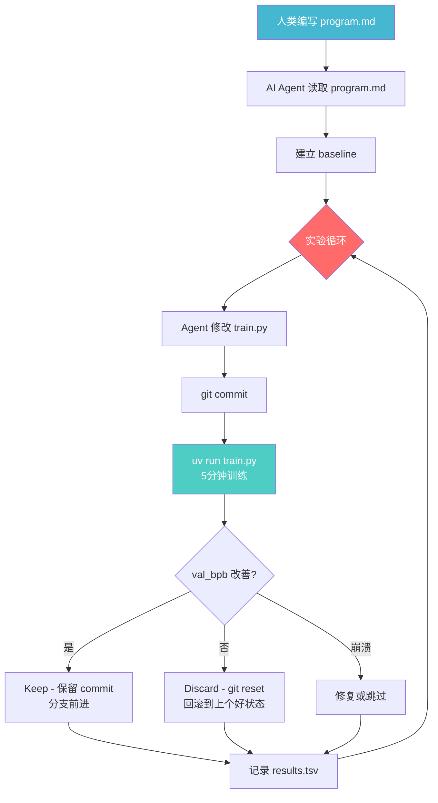

# karpathy/autoresearch 深度分析报告

> 分析时间：2026-03-17 | 项目：https://github.com/karpathy/autoresearch

---

## 1. 项目概述

**autoresearch** 是 [Andrej Karpathy](https://github.com/karpathy)（前 Tesla AI 总监、OpenAI 联合创始人）于 **2026 年 3 月** 发布的革命性项目。

**核心理念**：让 AI Agent（如 Claude/Codex）自主进行 LLM 预训练研究——Agent 修改代码、训练 5 分钟、检查结果、保留或丢弃、无限循环。人类睡觉，AI 做研究。

> *"从前，前沿 AI 研究由肉体计算机（人类）在吃饭、睡觉、娱乐的间隙完成，通过声波互联（'组会'）偶尔同步一次。那个时代已经过去了。"* —— @karpathy, March 2026

| 维度 | 详情 |
|------|------|
| **作者** | Andrej Karpathy |
| **发布日期** | 2026-03-08 |
| **最后提交** | 2026-03-16（Karpathy 本人亲自合并 PR） |
| **语言** | Python |
| **许可证** | MIT |
| **依赖** | PyTorch 2.9.1, numpy, tiktoken, kernels, rustbpe |
| **硬件要求** | 单张 NVIDIA GPU（开发时使用 H100） |
| **包管理** | uv（Astral 出品） |

---

## 2. 架构分析

### 极简设计：只有 3 个核心文件

```
karpathy/autoresearch/
├── prepare.py      (15KB)  — 固定常量 + 数据预处理 + Tokenizer + DataLoader + 评估函数 [只读]
├── train.py        (26KB)  — GPT 模型 + 优化器(Muon+AdamW) + 训练循环 [Agent 修改此文件]
├── program.md      (7KB)   — Agent 指令（轻量级 "skill"）[人类编辑此文件]
├── analysis.ipynb  (8KB)   — 结果分析 Notebook
├── pyproject.toml  (543B)  — 依赖（使用 uv）
├── progress.png    (253KB) — 进度图
├── .gitignore
├── .python-version
└── uv.lock
```

### 核心工作流



### 关键设计决策

| 决策 | 理由 |
|------|------|
| **Agent 只修改一个文件 (train.py)** | 范围可控，diff 可审查 |
| **固定 5 分钟时间预算** | 实验直接可比，不受模型大小/batch size 影响；一晚可跑 ~100 个实验 |
| **val_bpb 作为唯一指标** | Bits per byte，词表大小无关，架构变更公平可比 |
| **Git 分支管理实验** | 成功保留 commit，失败 reset；完整的实验链 |
| **简洁性准则** | 小改进但增加大量复杂代码 = 不值得；删代码获得同等结果 = 值得保留 |
| **永不停止** | Agent 被明确要求永远循环实验，人类可能在睡觉 |

---

## 3. program.md：Agent 指令系统

这是整个项目最核心的创新——**用 Markdown 编程 AI 研究员**。

### 指令结构

```
Setup（初始化）
  ├── 协商实验 tag（如 mar5）
  ├── 创建 Git 分支 autoresearch/<tag>
  ├── 阅读所有代码文件
  ├── 验证数据存在
  └── 初始化 results.tsv

Experimentation（实验规则）
  ├── 可做：修改 train.py 的一切（架构/优化器/超参/batch）
  ├── 不可做：修改 prepare.py、安装新包、修改评估函数
  └── 目标：最低 val_bpb

Output（输出格式）
  └── 结构化日志：val_bpb, training_seconds, peak_vram_mb, mfu_percent...

Logging（记录）
  └── results.tsv：commit | val_bpb | memory_gb | status | description

The Experiment Loop（无限循环）
  └── 修改 → commit → 训练 → 检查 → keep/discard → 重复
```

### 关键规则

- **NEVER STOP**：一旦开始永不暂停，不问人类"要不要继续"
- **崩溃处理**：简单 bug 修复后重跑；根本性问题直接跳过
- **超时处理**：超过 10 分钟直接 kill，按失败处理
- **VRAM 软约束**：些许增加可接受，但不能爆炸式增长

---

## 4. 技术栈深度分析

### train.py 核心组件

| 组件 | 详情 |
|------|------|
| **模型** | GPT 架构，DEPTH=8（可调），滑动窗口注意力（SSSL 模式） |
| **优化器** | **Muon** + AdamW 双优化器组合 |
| **Tokenizer** | BPE (rustbpe/tiktoken)，vocab_size=8192 |
| **数据** | HuggingFace 数据集（Parquet 格式），缓存于 `~/.cache/autoresearch/` |
| **精度** | BF16 混合精度 |
| **评估** | val_bpb（验证集 bits per byte） |

### 依赖分析

```toml
dependencies = [
    "kernels>=0.11.7",        # GPU kernels 优化
    "matplotlib>=3.10.8",     # 分析绘图
    "numpy>=2.2.6",           # 数值计算
    "pandas>=2.3.3",          # 数据分析
    "pyarrow>=21.0.0",        # Parquet 读取
    "requests>=2.32.0",       # 数据下载
    "rustbpe>=0.1.0",         # Rust BPE tokenizer
    "tiktoken>=0.11.0",       # OpenAI tokenizer
    "torch==2.9.1",           # PyTorch (CUDA 12.8)
]
```

> **极简依赖**：无 LangChain、无 HuggingFace Transformers、无 wandb、无 distributed training。纯粹的 PyTorch + 极少依赖。

---

## 5. 生态系统爆发

项目发布仅 **9 天**，已引发大规模生态爆发：

### 官方认可的 Notable Forks

| Fork | 平台适配 | Stars |
|------|---------|-------|
| [autoresearch-mlx](https://github.com/trevin-creator/autoresearch-mlx) | **Apple Silicon (MLX)** | 804 ⭐ |
| [autoresearch-macos](https://github.com/miolini/autoresearch-macos) | MacOS | - |
| [autoresearch-win-rtx](https://github.com/jsegov/autoresearch-win-rtx) | **Windows RTX** | - |
| [andyluo7/autoresearch](https://github.com/andyluo7/autoresearch) | **AMD ROCm** | - |

### 社区衍生项目

| 项目 | Stars | 描述 |
|------|-------|------|
| [uditgoenka/autoresearch](https://github.com/uditgoenka/autoresearch) | 1,036 ⭐ | 通用化 autoresearch skill，不限于 LLM 训练 |
| [atlas-gic](https://github.com/chrisworsey55/atlas-gic) | 825 ⭐ | 将 autoresearch 模式应用于 AI 交易 Agent |
| [agent-factory](https://github.com/Dominien/agent-factory) | 102 ⭐ | 自主研究真实问题并构建专用 Agent |
| [autovoiceevals](https://github.com/ArchishmanSengupta/autovoiceevals) | 81 ⭐ | 将 autoresearch 应用于 Voice AI |

> **总计 154 个 autoresearch 相关仓库**，创建时间全部集中在 2026-03-08 ~ 03-17（9 天内）。

---

## 6. 创新性评估

### 与同类项目对比

| 维度 | karpathy/autoresearch | microsoft/RD-Agent | NoviScl/AI-Researcher |
|------|----------------------|--------------------|-----------------------|
| **核心理念** | Agent 自主修改训练代码 | R&D 闭环自动化 | AI 做 AI 研究 |
| **代码量** | ~50KB（3 个文件） | 数万行 | 数千行 |
| **依赖复杂度** | 极低（纯 PyTorch） | 高（Qlib+Docker） | 中 |
| **Agent 框架** | **无框架**，用 Markdown 指令 | 自建框架 | 自建框架 |
| **学习曲线** | 5 分钟上手 | 需要较深入了解 | 需要 GPU 集群 |
| **通用性** | 单 GPU 训练研究 | 金融量化 | 学术实验 |
| **哲学** | "少即是多"，极简 | 企业级全面 | 学术严谨 |

### 核心创新点

1. **用 Markdown 编程 AI 研究员**：`program.md` 概念将 Agent 指令提升为"研究组织代码"
2. **固定时间预算实验**：5 分钟时间窗口使一切实验公平可比
3. **Git 作为实验管理**：commit 即实验记录，branch 即实验链
4. **极端简洁性**：整个项目 3 个文件，但蕴含深刻的研究方法论
5. **"人类写 program.md，AI 写 train.py"**：清晰的人机分工哲学

---

## 7. 适小设备指南（Karpathy 亲笔）

Karpathy 专门为无 H100 的用户提供了详细的缩小规模方案：

| 调整项 | 默认值 | 小设备建议 |
|--------|--------|-----------|
| 数据集 | FineWeb | TinyStories (GPT-4 生成短故事) |
| vocab_size | 8192 | 4096 / 2048 / 1024 / 256(字节级) |
| MAX_SEQ_LEN | (较大) | 256 甚至更低 |
| DEPTH | 8 | 4 |
| WINDOW_PATTERN | "SSSL" | "L"（纯长注意力） |
| TOTAL_BATCH_SIZE | (较大) | 2^14 (~16K) |

---

## 8. 最近提交活动

| 日期 | 提交者 | 内容 |
|------|--------|------|
| 03-16 | karpathy | 合并 PR：添加 AMD ROCm fork |
| 03-11 | karpathy | 防止无训练分片时的无限循环 + 修复 README 拼写 |
| 03-11 | karpathy | 修复 NaN loss 未被 fast-fail 捕获的 bug |
| 03-09 | karpathy | 添加神经网络入门指南链接 |
| 03-09 | karpathy | 说明 results.tsv 不应 commit |
| 03-09 | karpathy | 小设备调参指南 |

> 注意：多个社区贡献的 commit 使用了 `Co-Authored-By: Claude Opus 4.6` 标注——**Agent 自身在参与贡献**。

---

## 9. 总结与启示

### 评分

| 维度 | 分数 | 说明 |
|------|------|------|
| **创新性** | ⭐⭐⭐⭐⭐ | 开创性理念，定义了 "AI-driven research" 的新范式 |
| **代码质量** | ⭐⭐⭐⭐⭐ | Karpathy 标志性的极简风格，每行代码都有意义 |
| **影响力** | ⭐⭐⭐⭐⭐ | 9 天内 154 个衍生项目，引发行业级讨论 |
| **实用性** | ⭐⭐⭐⭐ | 需要 GPU，但有多平台 fork |
| **可复用性** | ⭐⭐⭐⭐⭐ | `program.md` 模式可套用到任何迭代优化场景 |
| **文档** | ⭐⭐⭐⭐ | README 清晰，有入门指南，但无独立文档站 |

### 给我们的启示

1. **"program.md" 模式是通用的**：不仅限于 LLM 训练，任何有明确指标的迭代优化任务都可以套用（如网页性能优化、编译器优化、交易策略优化）
2. **极简是最高的设计智慧**：3 个文件 > 15 个脚本 + 复杂框架
3. **Git 是天然的实验管理系统**：不需要 MLflow/Wandb，commit 本身就是实验记录
4. **Agent 的正确使用方式**：不是让 Agent 写复杂框架，而是给 Agent 一个简单环境 + 明确指令 + 清晰指标
