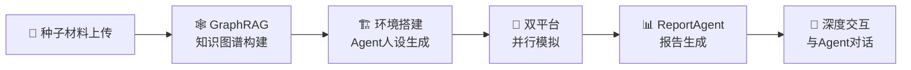

# MiroFish GitHub 项目分析报告

## 1. 研究概述

- **搜索方法**: GitHub 关键词搜索（MiroFish, 群体智能引擎, 多智能体预测）
- **目标仓库**: [666ghj/MiroFish](https://github.com/666ghj/MiroFish)
- **分析日期**: 2026-03-26
- **分析深度**: README + 依赖文件 + 代码目录结构 + Docker 配置 + 环境变量

---

## 2. 项目基本信息

| 维度 | 详情 |
|------|------|
| **仓库** | `666ghj/MiroFish` |
| **定位** | 简洁通用的群体智能引擎，预测万物 |
| **⭐ Stars** | 42.9k |
| **🍴 Forks** | 5.9k |
| **👀 Watchers** | 259 |
| **📝 Commits** | 220+ |
| **👥 Contributors** | 2 |
| **📄 License** | AGPL-3.0 |
| **语言构成** | Python 57.8% + Vue 41.1% |
| **创建者** | 郭航江（本科大四学生） |
| **支持方** | 盛大集团战略支持与孵化 |
| **官网** | [mirofish.ai](https://mirofish.ai) |
| **影响力** | 2026年3月登顶 GitHub Global Trending 第一 |

### Topics 标签

`python3` `knowledge-graph` `swarm-intelligence` `multi-agent-simulation` `social-prediction` `future-prediction` `financial-forecasting` `public-opinion-analysis` `llms` `agent-memory`

---

## 3. 项目愿景与定位

MiroFish 是一款 **基于多智能体技术的新一代 AI 预测引擎**，核心理念：

- **宏观**：决策者的预演实验室，让政策与公关在零风险中试错
- **微观**：个人用户的创意沙盘，推演小说结局、探索脑洞
- **口号**：让每一个"如果"都能看见结果，让预测万物成为可能

**用户操作流程**：
1. 上传种子材料（数据分析报告 / 小说故事）
2. 用自然语言描述预测需求
3. 获得：详尽的预测报告 + 可深度交互的高保真数字世界

---

## 4. 技术架构深度分析

### 4.1 五阶段预测流水线

```
1. 图谱构建 → GraphRAG 解析种子文档，抽取实体与关系，构建知识图谱
2. 环境搭建 → 生成 Agent 人设 + 注入仿真参数 + 配置模拟环境
3. 开始模拟 → 双平台并行模拟 + 自动解析预测需求 + 动态更新时序记忆
4. 报告生成 → ReportAgent 使用工具集深度分析舆论变化与涌现模式
5. 深度互动 → 与模拟世界中任意 Agent 或 ReportAgent 对话交互
```



### 4.2 技术栈总览

#### 后端（Python 3.11+）

| 组件 | 技术 | 版本 | 用途 |
|------|------|------|------|
| Web 框架 | Flask + Flask-CORS | ≥3.0 / ≥6.0 | REST API 服务 |
| LLM 接口 | OpenAI SDK | ≥1.0 | 兼容 OpenAI 格式的任意 LLM |
| Agent 记忆 | Zep Cloud | 3.13.0 | Agent 长期记忆与知识图谱 |
| 仿真引擎 | CAMEL-OASIS | 0.2.5 | 大规模多智能体社会仿真 |
| AI 框架 | CAMEL-AI | 0.2.78 | 智能体框架基础 |
| 文档解析 | PyMuPDF | ≥1.24 | PDF 文件读取与处理 |
| 数据验证 | Pydantic | ≥2.0 | 数据模型与类型校验 |
| 编码处理 | charset-normalizer / chardet | ≥3.0 / ≥5.0 | 非 UTF-8 编码兼容 |
| 环境管理 | python-dotenv | ≥1.0 | 环境变量管理 |
| 包管理 | uv | - | 高性能 Python 包管理器 |

#### 前端

| 组件 | 技术 | 版本 | 用途 |
|------|------|------|------|
| 核心框架 | Vue 3 | ^3.5.24 | SPA 单页应用 |
| 构建工具 | Vite | ^7.2.4 | 开发与构建 |
| 可视化 | D3.js | ^7.9.0 | 数据可视化（知识图谱展示） |
| 路由 | Vue Router | ^4.6.3 | 前端路由 |
| HTTP | Axios | ^1.13.2 | API 请求 |
| 脚手架 | @vitejs/plugin-vue | ^6.0.1 | Vue + Vite 插件 |

#### 部署

| 组件 | 技术 | 说明 |
|------|------|------|
| 容器化 | Docker Compose | 一键部署 |
| 镜像源 | ghcr.io / ghcr.nju.edu.cn | 国际 + 南大加速镜像 |
| 端口映射 | 3000(前端) / 5001(后端) | |
| 数据持久化 | volumes: uploads 目录 | 上传文件持久化 |

### 4.3 后端代码架构

```
backend/
├── app/
│   ├── __init__.py          # Flask 应用工厂
│   ├── config.py            # 配置管理
│   ├── api/                 # REST API 路由层
│   ├── models/              # 数据模型定义
│   ├── services/            # 核心业务逻辑层
│   └── utils/               # 工具函数
├── scripts/                 # 运维/辅助脚本
├── run.py                   # 应用入口
├── pyproject.toml           # Python 项目配置
├── requirements.txt         # 依赖清单
└── uv.lock                  # uv 锁定文件
```

### 4.4 前端代码架构

```
frontend/
├── public/                  # 静态资源
├── src/                     # 源代码
├── index.html               # HTML 入口
├── vite.config.js           # Vite 配置
└── package.json             # 依赖管理
```

### 4.5 外部依赖与 API

| 服务 | 用途 | 配置方式 |
|------|------|----------|
| **LLM API** | 智能体推理核心 | OpenAI SDK 兼容格式（推荐阿里百炼 qwen-plus） |
| **Zep Cloud** | Agent 长期记忆图谱 | API Key（免费额度足够简单使用） |
| **OASIS** | 社会仿真引擎 | Python 包内置（来自 CAMEL-AI 团队） |

---

## 5. 核心特性分析

### ✅ 亮点

| 特性 | 说明 |
|------|------|
| **GraphRAG 知识图谱** | 自动从种子文档抽取实体与关系，构建结构化世界观 |
| **大规模多智能体仿真** | OASIS 引擎支持百万级 Agent 交互 |
| **智能体长期记忆** | Zep Cloud 提供持久记忆与知识图谱 |
| **ReportAgent 工具集** | 自动生成分析报告，深度挖掘舆论变化 |
| **深度交互** | 可与仿真世界中任意 Agent 对话 |
| **双平台并行模拟** | 提高效率与多样性 |
| **Docker 一键部署** | 包含加速镜像，部署友好 |
| **LLM 通用兼容** | 支持 OpenAI SDK 格式的任意 LLM |

### ⚠️ 注意事项

| 维度 | 说明 |
|------|------|
| **LLM 消耗** | 消耗较大，建议先进行 <40 轮模拟尝试 |
| **AGPL-3.0 协议** | 衍生作品必须开源，商业使用需注意合规 |
| **外部依赖** | 依赖 Zep Cloud 和 LLM API，需联网 |
| **团队规模小** | 仅 2 位贡献者，可持续性待观察 |
| **测试覆盖** | 仅有 dev 测试依赖声明，实际覆盖率未知 |

---

## 6. 演示案例

根据 README 展示的两个演示视频：

1. **武汉大学舆情推演预测** — 严肃预测场景
2. **《红楼梦》失传结局推演预测** — 趣味仿真场景

---

## 7. 相关项目

| 项目 | 关系 | 说明 |
|------|------|------|
| [CAMEL-AI/OASIS](https://github.com/camel-ai/oasis) | 核心依赖 | 开源社会仿真引擎 |
| [MiroFish-Offline](https://github.com/666ghj/MiroFish-Offline) | 离线版本 | 无需云 API，使用 Neo4j + Ollama |

---

## 8. 评分与评估

| 维度 | 得分 | 说明 |
|------|------|------|
| **相关性** | 1.0 | 完全匹配用户查询 |
| **质量** | 0.92 | 42.9k Stars，活跃开发，有 Docker 支持 |
| **活跃度** | 0.95 | 220+ commits，最近持续更新 |
| **综合评分** | **0.96** | 顶级开源项目 |

### 评估公式

```
composite_score = relevance × 0.4 + quality × 0.35 + activity × 0.25
                = 1.0 × 0.4 + 0.92 × 0.35 + 0.95 × 0.25
                = 0.40 + 0.322 + 0.2375
                = 0.96
```

---

## 9. 推荐方案

### 🏆 最佳实践建议

1. **学习项目**：非常适合学习多智能体系统架构、GraphRAG、知识图谱构建
2. **二次开发**：基于 AGPL-3.0，可以 Fork 并添加自定义仿真场景
3. **技术研究**：OASIS + Zep Cloud 的组合是研究大规模社会仿真的优秀参考

### 🔑 关键可复用组件

- GraphRAG 知识图谱构建流程
- 多智能体人设生成与记忆管理
- ReportAgent 报告生成工具链
- Flask + Vue 全栈项目脚手架

---

## 10. 总结

MiroFish 是 2026 年 3 月最受关注的 AI 开源项目之一，登顶 GitHub Global Trending。项目通过创新的"群体智能仿真"范式，将多智能体技术从研究领域拉入了普通用户可触及的产品形态。技术栈现代（Vue 3 + Flask + OASIS），架构清晰（前后端分离 + API 层 + 服务层），部署友好（Docker 一键启动）。

**核心竞争力**：将 GraphRAG、大规模社会仿真、LLM Agent 记忆三大技术融合，实现了从"种子信息输入"到"预测报告输出 + 深度交互"的完整闭环。
