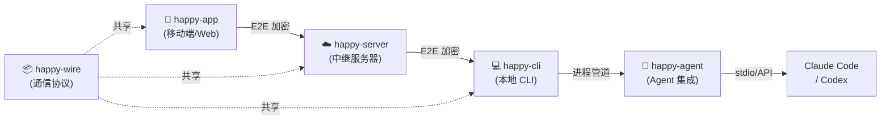

# Happy 项目分析

> 仓库地址：[slopus/happy](https://github.com/slopus/happy)

## 项目概览

| 维度 | 内容 |
|:---|:---|
| **名称** | Happy |
| **描述** | Mobile and Web Client for Claude Code & Codex |
| **Stars** | ⭐ 15,305 |
| **Forks** | 🍴 1,194 |
| **Open Issues** | 📋 607 |
| **语言** | TypeScript |
| **创建时间** | 2025-07-18 |
| **最新提交** | 2026-02-26 |
| **许可证** | MIT |
| **默认分支** | main |
| **标签** | v3 |
| **Topics** | claude-code, claude-desktop, claude-mobile, codex, codex-cli, hacktoberfest |

## 核心定位

Happy 是一个**端到端加密**的移动端和 Web 客户端，让用户可以在任何地方使用 Claude Code 或 OpenAI Codex。核心使用场景：

- 📱 **手机远程控制**：通过 iOS/Android 原生 App 或 Web 客户端远程操控桌面上的 AI 编码 Agent
- 🎙️ **语音驱动编码**：支持实时语音指令，解放双手
- 🔒 **端到端加密**：代码和会话数据在传输中保持私密
- 🔔 **推送通知**：权限请求或错误时通过手机推送提醒

## Monorepo 架构

项目采用 Yarn Workspaces 的 monorepo 架构，包含 5 个子包：

```
packages/
├── happy-agent/    # Agent 集成层（封装 Claude Code / Codex 交互）
├── happy-app/      # 移动端 App（React Native / Expo）
├── happy-cli/      # CLI 命令行工具（npm 全局安装 happy-coder）
├── happy-server/   # 中继服务器（WebSocket 转发 + 加密通道）
└── happy-wire/     # 通信协议层（序列化/反序列化）
```

### 架构流程



## 核心开发者

| 开发者 | GitHub | 角色 |
|:---|:---|:---|
| Steve Korshakov | [@ex3ndr](https://github.com/ex3ndr) | 创始人/主要贡献者 |
| Kirill Dubovitskiy | [@bra1nDump](https://github.com/bra1nDump) | 核心贡献者（与 Claude Opus 4.6 协作编码） |

## 技术栈

| 层级 | 技术 |
|:---|:---|
| **移动端** | React Native + Expo (EAS Build) |
| **Web 端** | React (WebApp) |
| **CLI** | Node.js + TypeScript |
| **服务端** | Node.js + Prisma + PGlite |
| **通信协议** | 自定义 Wire 协议 (happy-wire) |
| **部署** | Docker (多阶段构建: Dockerfile, Dockerfile.server, Dockerfile.webapp) |
| **包管理** | Yarn Workspaces |
| **AI Agent** | Claude Code, Codex CLI (通过 ACP 协议集成) |

## 快速开始

```bash
# 全局安装 CLI
npm install -g happy-coder

# 包装 Codex 会话实现远程访问
happy codex

# 包装 Claude Code 会话
happy
```

## 近期开发动态（最近 20 条提交）

| 日期 | 类型 | 描述 |
|:---|:---|:---|
| 2026-02-26 | fix | 隐藏 Claude Code 内部 ToolSearch 工具的 UI 展示 |
| 2026-02-26 | fix | 修复 pglite-prisma-adapter Bytes 列序列化问题 |
| 2026-02-26 | feat | 新增 agent-browser 和 terminal-emulator 技能 |
| 2026-02-14 | feat | 元数据驱动的模型/模式选择 + 同步模式 |
| 2026-02-14 | fix | 改进 ACP 集成诊断日志 |
| 2026-02-14 | fix | 优化 ACP 日志方向和可见性 |
| 2026-02-14 | fix | Docker 构建修复：安装前复制根 scripts |
| 2026-02-14 | feat | ACP 支持从 session config 切换模型和模式 |
| 2026-02-14 | feat | ACP 启动时报告 session config 元数据 |
| 2026-02-14 | feat | CLI 新增通用 ACP runner 和 session mapper |
| 2026-02-14 | ref | 移除仓库中的原生构建产物 |
| 2026-02-13 | ref | 所有 release 操作排除 OTA |
| 2026-02-13 | feat | 新增 happy-app 交互式发布选项 |

## 关键特性分析

### 1. ACP（Agent Communication Protocol）
近期大量提交围绕 ACP 协议，这是 Happy 与各种 AI Agent 通信的核心协议层。支持：
- 从移动端 session config 动态切换模型
- 通用 ACP runner 支持多种 Agent 后端
- 结构化的诊断日志

### 2. AI 辅助开发
项目本身大量使用 AI 辅助编码（Co-Authored-By: Claude Opus 4.6），体现了 **dog-fooding** 实践。

### 3. Docker 多部署形态
- `Dockerfile` - 完整部署（CLI + Server + WebApp）
- `Dockerfile.server` - 仅中继服务器
- `Dockerfile.webapp` - 仅 Web 客户端

## 竞品与生态

| 项目 | 特点 |
|:---|:---|
| **HAPI (tiann/hapi)** | 本地优先，支持 Telegram Mini App 控制 |
| **Happier** | Happy 分支，支持更多 Agent（Kimi, Augment Code, Qwen 等） |

## 适用场景

1. **远离电脑时监控长时间运行的 AI 编码任务**
2. **手机上快速审批/拒绝 Agent 的代码建议**
3. **出差通勤时用语音指挥 AI 写代码**
4. **团队协作场景下远程 review AI 生成的 PR**
