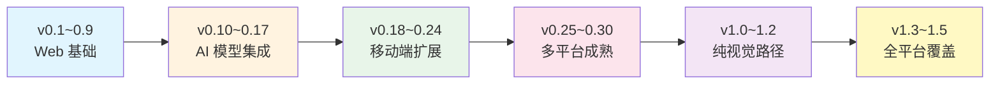
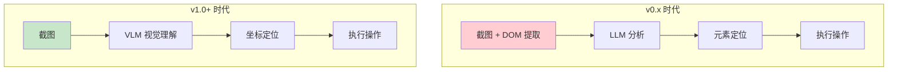
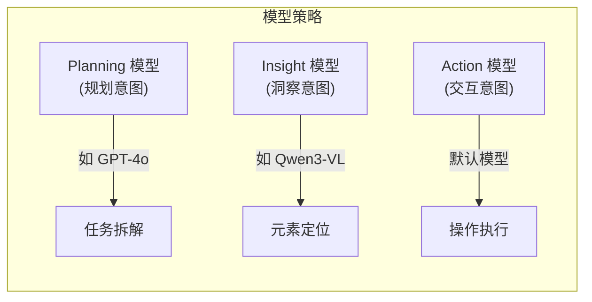

# Midscene 框架版本演进深度分析

> **分析时间**: 2026-03-16  
> **分析范围**: v0.1.0 → v1.5.5（完整生命周期）  
> **仓库**: [web-infra-dev/midscene](https://github.com/web-infra-dev/midscene) ⭐ 12,175  
> **定位**: AI-powered, vision-driven UI automation for every platform

---

## 一、项目概览

Midscene 是由 web-infra-dev 团队开发的 **AI 驱动的视觉 UI 自动化框架**，使用 TypeScript 编写。它通过视觉语言模型（VLM）理解屏幕截图，用自然语言描述替代传统选择器，实现跨平台 UI 自动化。

### 核心理念演变



---

## 二、里程碑版本详解

### 🏁 v1.0.0 — 正式发布（2025-12-18）

v1.0 标志着 Midscene 从实验性项目进入**生产就绪**阶段，核心变革：

| 维度 | 变更内容 |
|------|---------|
| **纯视觉路径** | 完全采用视觉理解方式，不再依赖 DOM 提取，Token 消耗降低约 **80%** |
| **多模型组合** | 支持规划（Planning）、洞察（Insight）、交互（Interaction）三种意图分别配置不同模型 |
| **MCP 重构** | 以 Action Space 为单位暴露 MCP 工具，iOS/Android/Web 统一 |
| **API 重命名** | `aiAction()` → `aiAct()`，`OPENAI_API_KEY` → `MIDSCENE_MODEL_API_KEY`（向后兼容） |
| **报告增强** | 暗色模式、Token 用量显示、参数可视化 |

---

### 🚀 v1.1.0 — aiAct 深度思考 + MCP SDK（2026-01-05）

- **aiAct 深度思考（deepThink）**: 支持 Qwen3-VL 和 Doubao-Vision 模型在规划时使用深度推理
- **MCP 启动器**: 新增 Android、iOS、Web MCP 服务启动器工具
- **Chrome 扩展改进**: 修复录制器和描述矩形传递问题
- **动态重规划限制**: 增加环境配置的重规划循环上限

---

### 🚀 v1.2.0 — 智谱 AI 开源模型 + 文件上传（2026-01-08）

- **智谱 GLM-V 视觉模型**: 支持多参数版本，云端和本地部署
- **智谱 AutoGLM**: 开源移动自动化模型，理解屏幕内容并生成操作流程
- **文件上传**: Web 自动化支持自然语言操作文件输入框
- **缓存优化**: DOM 变更后自动更新缓存，避免操作失败

---

### 🚀 v1.3.0 — PC 桌面自动化（2026-01-27）

**里程碑意义**: Midscene 从 Web + 移动端扩展到 **PC 桌面**

| 新能力 | 详情 |
|-------|------|
| **@midscene/computer** | 全新 PC 桌面自动化包，基于 libnut 实现跨平台桌面控制 |
| **scrcpy 高性能截图** | 零缓冲架构实现 Android 实时截图，性能大幅提升 |
| **XML 格式规划** | LLM 规划输出从 JSON 切换到 XML 格式，提升解析稳定性 |
| **App 名称映射** | 新增应用名称推理和标准化功能 |
| **sleep 动作** | 在动作空间中暴露 sleep，支持等待操作 |

---

### 🚀 v1.4.0 — Skills 技能系统（2026-02-12）

**核心创新**: 引入 **Midscene Skills** 概念——让 AI 助手控制设备的技能包

- **Skills 系统**: 独立仓库 [midscene-skills](https://github.com/web-infra-dev/midscene-skills)，AI Agent 可调用预定义设备操作技能
- **@midscene/computer-mcp**: 独立桌面自动化 MCP 包
- **Chrome 扩展 MCP 后台桥接**: 支持通过 MCP 连接 Chrome 扩展
- **深度思考增强**: aiAct 工具支持 deepThink，捕获动作执行结果
- **iOS MJPEG 实时流**: Playground 支持 iOS 设备实时视频流

---

### 🚀 v1.5.0 — 鸿蒙 HarmonyOS 支持（2026-03-02）

**全平台达成**: Web / Android / iOS / PC Desktop / **HarmonyOS**

| 新能力 | 详情 |
|-------|------|
| **@midscene/harmony** | 全新鸿蒙自动化包，完成全平台覆盖 |
| **deepLocate** | deepThink 重命名为 deepLocate，更精确的元素定位深度推理 |
| **Qwen3.5 + doubao-seed 2.0** | 支持最新 AI 模型 |
| **Xvfb 虚拟显示** | 支持 Linux 无头环境下的桌面自动化 |
| **Skill CLI** | 新增技能命令行工具支持自定义接口 |

---

## 三、核心能力演进时间线

### 3.1 平台支持扩展

```
v0.1.0 (2024)     ├── Web (Playwright)
v0.2.0             ├── Web (Puppeteer)  
v0.8.0             ├── Chrome Extension
v0.15.0            ├── Android (ADB)
v0.29.0            ├── iOS (WebDriver)
v1.3.0  (2026-01)  ├── PC Desktop (libnut)
v1.5.0  (2026-03)  └── HarmonyOS
```

### 3.2 AI 模型支持演进

| 版本 | 新增模型支持 |
|------|------------|
| v0.5.0 | GPT-4o 结构化输出 |
| v0.6.0 | 豆包（Doubao）模型 |
| v0.10.0 | UI-TARS 视觉模型 |
| v0.12.0 | 通义千问 Qwen 2.5 VL |
| v0.29.0 | Qwen3-VL |
| v1.0.0 | 纯视觉路径，多模型组合策略 |
| v1.1.0 | deepThink 支持 Qwen3-VL / Doubao-Vision |
| v1.2.0 | 智谱 GLM-V + AutoGLM |
| v1.0.1 | Gemini-3-Flash |
| v1.4.6 | Qwen3.5 + doubao-seed 2.0 |
| v1.5.5 | GPT-5.4 |

### 3.3 核心功能演进

| 能力 | 首个版本 | 关键改进 |
|------|---------|---------|
| **自然语言控制** | v0.1.0 | 始终是核心能力 |
| **AI 报告系统** | v0.3.0 | v0.18 视频导出, v0.23 全新样式, v1.0 暗色模式 |
| **CLI 工具** | v0.4.0 | v0.23 YAML 多文件执行, v1.4 CLI 版本支持 |
| **Playground** | v0.7.0 | v0.28 通用 Playground, v1.4 iOS MJPEG 流 |
| **Chrome 扩展** | v0.8.0 | v0.22 录制功能, v0.27 全 AI 方法支持 |
| **Bridge 模式** | v0.9.0 | v1.3 Chrome 扩展桥接缓存 |
| **DeepThink 模式** | v0.13.0 | v1.0 纯视觉路径, v1.5 重命名为 deepLocate |
| **Instant Actions** | v0.14.0 | v0.26 Action Space 重构 |
| **MCP 支持** | v0.16.0 | v1.0 架构重设计, v1.3 computer-mcp |
| **缓存机制** | v0.11.0 | v0.25 规划缓存, v0.30 读写策略, v1.2 DOM 变更更新 |
| **YAML 脚本** | v0.23.0 | v0.28 通用设备, v1.3 fileChooserAccept |
| **文件上传** | v1.2.0 | Web 自动化文件输入 |
| **Skills 系统** | v1.4.0 | AI Agent 设备控制技能 |

---

## 四、架构演进分析

### 4.1 从 DOM 到纯视觉



**关键变化**:
- v0.x: 截图 + DOM 树 → Token 消耗大，依赖渲染技术栈
- v1.0: 纯截图 → Token 降低 80%，跨平台统一

### 4.2 多模型策略架构



### 4.3 包结构演进

```
@midscene/web          — Web 自动化 (Playwright / Puppeteer)
@midscene/android      — Android 自动化 (ADB / Scrcpy)
@midscene/ios          — iOS 自动化 (WebDriver)
@midscene/computer     — PC 桌面自动化 (libnut)     [v1.3 新增]
@midscene/harmony      — 鸿蒙自动化                [v1.5 新增]
@midscene/cli          — 命令行工具
@midscene/core         — 核心引擎
@midscene/shared       — 共享工具库
@midscene/visualizer   — 可视化组件
@midscene/mcp          — MCP Web 集成
@midscene/computer-mcp — MCP 桌面集成             [v1.3 新增]
```

---

## 五、版本发布节奏统计

### 按月发布统计

| 月份 | 版本范围 | 发布数量 |
|------|---------|---------|
| 2025-07 | v0.20.0 ~ v0.23.4 | 11 |
| 2025-08 | v0.24.0 ~ v0.27.6 | 18 |
| 2025-09 | v0.28.0 ~ v0.30.1 | 17 |
| 2025-10 | v0.30.2 ~ v0.30.10 | 9 |
| 2025-11 | v0.30.8 | 1 |
| 2025-12 | v0.30.9 ~ v1.0.4 | 8 |
| 2026-01 | v1.1.0 ~ v1.3.4 | 10 |
| 2026-02 | v1.3.5 ~ v1.4.9 | 15 |
| 2026-03 | v1.5.0 ~ v1.5.5 | 6 |

> 高频发布模式：平均每 **3-5 天**一个版本，体现了快速迭代的开发节奏。

### 主要贡献者

| 贡献者 | 角色/专长 |
|-------|---------|
| **@quanru** | 核心开发，Android/iOS/PC/Chrome 扩展 |
| **@yuyutaotao** | AI 模型集成、规划系统、API 设计 |
| **@EAGzzyCSL** | 核心引擎、构建系统、模型配置 |
| **@zhoushaw** | Chrome 扩展录制器、MCP Android |
| **@frank-mupt** | Android 优化、应用名称映射 |

---

## 六、技术趋势洞察

### 6.1 关键技术方向

1. **视觉优先**: v1.0 后完全拥抱 VLM，是 UI 自动化领域的范式转变
2. **全平台统一**: 从 Web-only 扩展到 5 个平台，共用同一套 AI 核心引擎
3. **MCP 生态**: 深度集成 Model Context Protocol，成为 AI Agent 的设备控制层
4. **Skills 系统**: 向着可复用、可组合的自动化能力单元方向发展
5. **开源模型友好**: 积极适配 Qwen、GLM-V、AutoGLM 等开源视觉模型

### 6.2 对比竞品定位

| 特性 | Midscene | Playwright | Appium | Browser-Use |
|------|----------|------------|--------|-------------|
| AI 驱动 | ✅ 原生 | ❌ | ❌ | ✅ |
| 纯视觉 | ✅ v1.0+ | ❌ | ❌ | ✅ |
| 多平台 | ✅ 5 平台 | Web only | 移动端 | Web only |
| MCP | ✅ | ❌ | ❌ | ❌ |
| 自然语言 | ✅ | ❌ | ❌ | ✅ |
| 缓存加速 | ✅ | N/A | N/A | ❌ |
| Skills | ✅ v1.4+ | N/A | N/A | ❌ |

---

## 七、总结

Midscene 在不到两年时间内（2024-07 ~ 2026-03）完成了从 v0.1 到 v1.5 的跨越式发展：

- **v0.x 时代** (2024-07 ~ 2025-12): 从 Playwright 自然语言控制起步，逐步扩展到多模型、多平台、MCP 协议，积累了完整的技术基础
- **v1.0 里程碑** (2025-12-18): 纯视觉路径革命，Token 降低 80%，多模型组合策略
- **v1.1~1.5 快速迭代** (2026-01 ~ 2026-03): 三个月内完成 deepThink、Skills、PC 桌面、鸿蒙四大功能模块，展现了强大的工程执行力

> **核心价值主张**: 用自然语言 + 视觉理解替代传统选择器，实现"截图即自动化"的跨平台 UI 操作能力。
